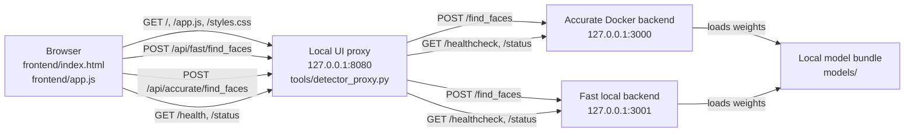
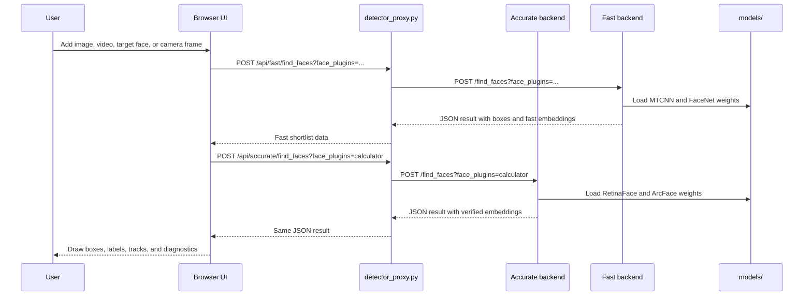

# FDX Detection-Only Runner

FDX is a trimmed, local face detection runner. It keeps the face-processing core
and a custom browser UI, while removing the upstream admin service, API service,
Postgres database, accounts, and login flow.

The default setup runs two detector services and a small local Python proxy/UI
server. ArcFace/RetinaFace runs in Docker on port `3000` for final accuracy,
FaceNet/MTCNN runs locally on port `3001` for fast prefiltering, and the UI
proxy runs on port `8080`.

## Quick start

Install Docker and `uv` (recommended) or Python 3.8, then place the model bundle
in `models/`. On its first run, FDX creates `.venv/` and installs the pinned
local Python 3.8/TensorFlow 2.2 runtime for the fast backend. Allow roughly 2 GB
of disk space for this one-time setup.

Expected model folder:

```text
models/
  facenet/
    calculator/20180402-114759/
  mtcnn/
    data/mtcnn_weights.npy
  insightface/
    detector/retinaface_r50_v1/
    calculator/arcface-r100-msfdrop75/
```

Run the detector and UI:

```sh
./run.sh
```

Open:

```text
http://127.0.0.1:8080
```

Stop the local detector service and UI proxy:

```sh
./stop.sh
```

## Architecture

`run.sh` checks `models/`, starts the accurate ArcFace Docker backend, bootstraps
the pinned Python runtime with `tools/bootstrap_local.sh` when needed, starts the
fast FaceNet backend, waits for both `/healthcheck` endpoints, then starts
`tools/detector_proxy.py`. Fast backend startup failures are printed immediately
and also written to `.fdx-fast-backend.log`.

The browser never calls detector services directly. It loads the static UI from
the proxy and sends detection requests through `/api/fast/find_faces` or
`/api/accurate/find_faces`. `/api/find_faces` remains an accurate-backend alias
for compatibility.

Main components:

| Component | Path | Role |
| --- | --- | --- |
| Browser UI | `frontend/` | Uploads images/videos, opens live scan, draws boxes, and stores target faces |
| Local proxy | `tools/detector_proxy.py` | Serves the UI and forwards detector API calls |
| Accurate detector | Docker `exadel/compreface-core:1.2.0-arcface-r100` | Runs RetinaFace and ArcFace R100 |
| Fast detector | `face-processing/ml/src/` | Runs MTCNN and FaceNet for prefiltering |
| Model bundle | `models/` | Stores local face detection and matching model weights |
| Source snapshot | `face-processing/ml/` | Keeps the local detector implementation and helper tools |



The UI has three pages:

- `Live Scan` opens the webcam, captures frames, sends them to the local
  detector, tracks faces, and draws a live overlay.
- `Detection` accepts images and videos. Images are detected once. Videos are
  analyzed at 30 fps by default, then the UI interpolates tracked boxes during
  playback.
- `Faces` lets you add target face images. The UI stores target previews and
  embeddings in browser `localStorage`, then uses them to name matching tracks.

## Workflow

Startup workflow:

1. `run.sh` validates the local `models/` directory.
2. The accurate detector starts in Docker on `127.0.0.1:3000`.
3. On first use, `tools/bootstrap_local.sh` installs Python 3.8 and the pinned
   detector dependencies into `.venv/`.
4. The fast local detector starts on `127.0.0.1:3001`.
5. `run.sh` waits until both `GET /healthcheck` endpoints respond.
6. `tools/detector_proxy.py` starts the UI and proxy on `127.0.0.1:8080`.
7. The browser opens the UI and sends all detection requests through the proxy.

Detection workflow:

1. The UI captures an uploaded image, a sampled video frame, or a live camera
   frame.
2. For batch images with saved targets, the UI first sends the frame to
   `POST /api/fast/find_faces` to detect faces and rank likely matches.
3. The UI crops the best candidates and sends only those crops to
   `POST /api/accurate/find_faces` for ArcFace verification.
4. For images without saved targets, the UI uses the accurate backend directly.
5. Live scan and video tracking use the fast backend for responsiveness.
6. The UI receives JSON results, draws overlays, and assigns track or target
   names when embeddings are available.



## Folder structure

This section uses a plain text tree so it remains readable even if GitHub's
Mermaid renderer fails to load.

```text
FDX/
|-- README.md
|-- run.sh
|-- stop.sh
|-- backend/
|   `-- README.md
|-- frontend/
|   |-- index.html
|   |-- app.js
|   `-- styles.css
|-- tools/
|   |-- bootstrap_local.sh
|   `-- detector_proxy.py
|-- models/
|   |-- facenet/
|   `-- mtcnn/
`-- face-processing/
    `-- ml/
        |-- assets/
        |   `-- warmup/
        |-- requirements-local.txt
        |-- requirements.txt
        |-- uwsgi.ini
        |-- pytest.ini
        |-- src/
        |   |-- _endpoints.py
        |   |-- app.py
        |   `-- services/
        |       |-- dto/
        |       |-- facescan/
        |       |   `-- plugins/
        |       |-- flask_/
        |       `-- imgtools/
        |-- srcext/
        |   `-- mtcnn/
        `-- tools/
```

Top-level files and directories:

- `run.sh` starts the accurate detector, fast detector, and local UI proxy.
- `stop.sh` stops both detector services and kills the proxy process.
- `tools/bootstrap_local.sh` creates the local Python 3.8 runtime for FaceNet.
- `frontend/` contains the browser app.
- `tools/detector_proxy.py` serves the UI and forwards requests to the detector.
- `models/` contains local model weights from Drive. This directory is ignored by
  git.
- `face-processing/` contains the Python face-processing source/config for
  inspection and reference.
- `backend/` contains backend notes for the trimmed runner.

## Runtime configuration

`run.sh` starts the accurate Docker backend with these important settings:

```text
ML_PORT=3000
IMG_LENGTH_LIMIT=1280
FACE_DETECTION_PLUGIN=insightface.FaceDetector@retinaface_r50_v1
CALCULATION_PLUGIN=insightface.Calculator@arcface-r100-msfdrop75
RUN_MODE=true
```

It also starts the fast local backend with these important settings:

```text
ML_PORT=3001
IMG_LENGTH_LIMIT=1280
FACE_DETECTION_PLUGIN=facenet.FaceDetector
CALCULATION_PLUGIN=facenet.Calculator
EXTRA_PLUGINS=
UWSGI_PROCESSES=1
UWSGI_THREADS=1
```

The UI uses the fast backend for prefiltering and live/video tracking, then uses
the accurate backend for final image match verification. Optional classification
plugins are not enabled unless you add them to `EXTRA_PLUGINS` and request their
slugs from the UI/API.

## Models

The model bundle lives in `models/` locally. Because `.gitignore` ignores
`models/`, these files are expected to be downloaded separately.

Models used by the default runner:

| Purpose | Plugin | Model architecture | Enabled by default |
| --- | --- | --- | --- |
| Fast face detection | `facenet.FaceDetector` | MTCNN | Yes |
| Fast matching embeddings | `facenet.Calculator` | FaceNet Inception ResNet v1 | Yes |
| Accurate face detection | `insightface.FaceDetector@retinaface_r50_v1` | RetinaFace R50 | Yes |
| Accurate matching embeddings | `insightface.Calculator@arcface-r100-msfdrop75` | ArcFace ResNet-100 | Yes |
| Mask detection | `facenet.facemask.MaskDetector` | Inception v3 classifier | No |

The default `run.sh` setup uses RetinaFace R50 for accurate detection and
ArcFace ResNet-100 for final matching. EfficientNet is not configured in this
repo.

Optional model families present in the source snapshot:

| Purpose | Optional architectures |
| --- | --- |
| InsightFace detection | RetinaFace MobileNet-0.25, RetinaFace ResNet-50 |
| InsightFace matching | ArcFace MobileFaceNet, ArcFace ResNet-34, ResNet-50, ResNet-100 |
| InsightFace mask detection | MobileNet v2, ResNet-18 |
| InsightFace landmarks | 2D-106 landmark detector |

## API surface

The proxy exposes the UI and these local routes:

| Proxy route | Upstream route | Purpose |
| --- | --- | --- |
| `GET /` | Static `frontend/index.html` | Loads the UI |
| `GET /health` | both `GET /healthcheck` endpoints | Checks detector readiness |
| `GET /status` | accurate `GET /status` | Reads accurate plugin status and similarity coefficients |
| `GET /fast/status` | fast `GET /status` | Reads fast plugin status and similarity coefficients |
| `POST /api/fast/find_faces` | fast `POST /find_faces` | Runs fast detection/prefiltering |
| `POST /api/accurate/find_faces` | accurate `POST /find_faces` | Runs accurate detection/final verification |
| `POST /api/find_faces` | accurate `POST /find_faces` | Compatibility alias for accurate detection |

Important `find_faces` query parameters:

- `face_plugins` is a comma-separated list of requested plugin slugs. The UI uses
  an empty value for boxes-only detection or `calculator` when matching targets.
- `limit=0` means no face limit.
- `det_prob_threshold` controls the minimum face confidence. The UI uses `0.80`
  for normal detection, live scan, and target faces.

The detector returns JSON with `plugins_versions` and a `result` array. Each
result always includes `box`; requested plugins can add `embedding`, `mask`,
`landmarks`, `pose`, and `execution_time` data.

## Video tracking

Upload a browser-supported video from the Detection page. The UI analyzes video
frames at 30 fps by default, detects faces, assigns persistent face IDs using
embeddings and box overlap, and draws smoothly interpolated tracked boxes during
playback. One-frame detections are discarded to reduce visual noise. If target
faces have been added, matching tracks use their saved names.

Live scan uses the same detector path with camera frames captured in the browser.
Frames are sent only to the local proxy and local detector service.

## What was removed

- Admin service
- API service
- Postgres service
- User accounts and login flow
- Original upstream frontend
- Bundled OS folders and runtime libraries
- Python caches, test folders, and sample images

## Troubleshooting

- If `models/` is missing, download the model bundle and place it at the repo
  root before running `./run.sh`.
- If the backend does not become ready, stop it with `./stop.sh`, then run
  `./run.sh` again and watch the terminal output.
- If the camera does not open, use `http://127.0.0.1:8080` or HTTPS. Browser
  camera APIs require localhost or a secure context.
