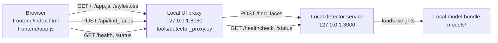
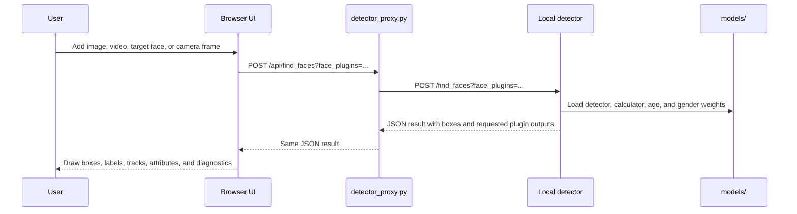

# FDX Detection-Only Runner

FDX is a trimmed, local face detection runner. It keeps the face-processing core
and a custom browser UI, while removing the upstream admin service, API service,
Postgres database, accounts, and login flow.

The default setup runs the local detector service on port `3000` and a small
local Python proxy/UI server on port `8080`.

## Quick start

Install Python 3, then place the downloaded model bundle in `models/`.

Expected model folder:

```text
models/
  agegender/
    age/22801/
    gender/21936/
  facemask/
    mask/inception_v3_on_mafa_kaggle123/
  facenet/
    calculator/20180402-114759/
  mtcnn/
    data/mtcnn_weights.npy
```

Run the detector and UI:

```sh
./run.sh
```

Open:

```text
http://127.0.0.1:8080
```

Stop the local detector service and UI proxy:

```sh
./stop.sh
```

## Architecture

`run.sh` checks for Python 3 and `models/`. It then starts the local detector
service, waits for `/healthcheck`, and starts `tools/detector_proxy.py`.

The browser never calls the detector service directly. It loads the static UI
from the proxy and sends detection requests to `/api/find_faces`. The proxy
serves `frontend/`, forwards health/status requests, and forwards face detection
uploads to `http://127.0.0.1:3000/find_faces`.



The UI has three pages:

- `Live Scan` opens the webcam, captures frames, sends them to the local
  detector, tracks faces, and draws a live overlay.
- `Detection` accepts images and videos. Images are detected once. Videos are
  analyzed at 30 fps by default, then the UI interpolates tracked boxes during
  playback.
- `Faces` lets you add target face images. The UI stores target previews and
  embeddings in browser `localStorage`, then uses them to name matching tracks.

## Workflow

Startup workflow:

1. `run.sh` validates Python 3 and the local `models/` directory.
2. The local detector starts on `127.0.0.1:3000`.
3. `run.sh` waits until `GET /healthcheck` responds.
4. `tools/detector_proxy.py` starts the UI and proxy on `127.0.0.1:8080`.
5. The browser opens the UI and sends all detection requests through the proxy.

Detection workflow:



## Folder structure

This section uses a plain text tree so it remains readable even if GitHub's
Mermaid renderer fails to load.

```text
FDX/
|-- README.md
|-- run.sh
|-- stop.sh
|-- backend/
|   `-- README.md
|-- frontend/
|   |-- index.html
|   |-- app.js
|   `-- styles.css
|-- tools/
|   `-- detector_proxy.py
|-- models/
|   |-- agegender/
|   |-- facemask/
|   |-- facenet/
|   `-- mtcnn/
`-- face-processing/
    `-- ml/
        |-- requirements.txt
        |-- uwsgi.ini
        |-- pytest.ini
        |-- src/
        |   |-- _endpoints.py
        |   |-- app.py
        |   `-- services/
        |       |-- dto/
        |       |-- facescan/
        |       |   `-- plugins/
        |       |-- flask_/
        |       `-- imgtools/
        |-- srcext/
        |   `-- mtcnn/
        `-- tools/
```

Top-level files and directories:

- `run.sh` starts the local detector service and the local UI proxy.
- `stop.sh` stops the local detector service and kills the proxy process.
- `frontend/` contains the browser app.
- `tools/detector_proxy.py` serves the UI and forwards requests to the detector.
- `models/` contains local model weights from Drive. This directory is ignored by
  git.
- `face-processing/` contains the Python face-processing source/config for
  inspection and reference.
- `backend/` contains backend notes for the trimmed runner.

## Runtime configuration

`run.sh` starts the local detector with these important settings:

```text
ML_PORT=3000
IMG_LENGTH_LIMIT=1280
FACE_DETECTION_PLUGIN=facenet.FaceDetector
CALCULATION_PLUGIN=facenet.Calculator
EXTRA_PLUGINS=agegender.AgeDetector,agegender.GenderDetector
UWSGI_PROCESSES=1
UWSGI_THREADS=1
```

The default runner loads face detection, embedding, age, and gender support. The
facemask model can exist in `models/`, but it is not enabled by `run.sh` unless
you add the mask plugin to `EXTRA_PLUGINS` and request `mask` from the UI/API.

## Models

The model bundle lives in `models/` locally. Because `.gitignore` ignores
`models/`, these files are expected to be downloaded separately.

Models used by the default runner:

| Purpose | Plugin | Model architecture | Enabled by default |
| --- | --- | --- | --- |
| Face detection | `facenet.FaceDetector` | MTCNN | Yes |
| Face matching embeddings | `facenet.Calculator` | FaceNet Inception ResNet v1 | Yes |
| Age detection | `agegender.AgeDetector` | Inception v3 classifier | Yes |
| Gender detection | `agegender.GenderDetector` | Inception v3 classifier | Yes |
| Mask detection | `facenet.facemask.MaskDetector` | Inception v3 classifier | No |

The default `run.sh` setup does not use ResNet-50 or EfficientNet. ResNet-50 is
only present in the source snapshot as an optional InsightFace/ArcFace model, and
EfficientNet is not configured in this repo.

Optional model families present in the source snapshot:

| Purpose | Optional architectures |
| --- | --- |
| InsightFace detection | RetinaFace MobileNet-0.25, RetinaFace ResNet-50 |
| InsightFace matching | ArcFace MobileFaceNet, ArcFace ResNet-34, ResNet-50, ResNet-100 |
| InsightFace mask detection | MobileNet v2, ResNet-18 |
| InsightFace landmarks | 2D-106 landmark detector |

## API surface

The proxy exposes the UI and these local routes:

| Proxy route | Upstream route | Purpose |
| --- | --- | --- |
| `GET /` | Static `frontend/index.html` | Loads the UI |
| `GET /health` | `GET /healthcheck` | Checks detector readiness |
| `GET /status` | `GET /status` | Reads plugin status and similarity coefficients |
| `POST /api/find_faces` | `POST /find_faces` | Detects faces in an uploaded image frame |

Important `find_faces` query parameters:

- `face_plugins` is a comma-separated list of requested plugin slugs. The UI uses
  `age,gender`, `calculator,age,gender`, or `calculator` depending on the page.
- `limit=0` means no face limit.
- `det_prob_threshold` controls the minimum face confidence. The UI uses `0.50`
  for normal detection and `0.55` when adding target faces.

The detector returns JSON with `plugins_versions` and a `result` array. Each
result always includes `box`; requested plugins can add `embedding`, `age`,
`gender`, `mask`, `landmarks`, `pose`, and `execution_time` data.

## Video tracking

Upload a browser-supported video from the Detection page. The UI analyzes video
frames at 30 fps by default, detects faces, assigns persistent face IDs using
embeddings and box overlap, and draws smoothly interpolated tracked boxes during
playback. One-frame detections are discarded to reduce visual noise. If target
faces have been added, matching tracks use their saved names.

Live scan uses the same detector path with camera frames captured in the browser.
Frames are sent only to the local proxy and local detector service.

## What was removed

- Admin service
- API service
- Postgres service
- User accounts and login flow
- Original upstream frontend
- Bundled OS folders and runtime libraries
- Python caches, test folders, and sample images

## Troubleshooting

- If `models/` is missing, download the model bundle and place it at the repo
  root before running `./run.sh`.
- If the backend does not become ready, stop it with `./stop.sh`, then run
  `./run.sh` again and watch the terminal output.
- If the camera does not open, use `http://127.0.0.1:8080` or HTTPS. Browser
  camera APIs require localhost or a secure context.
