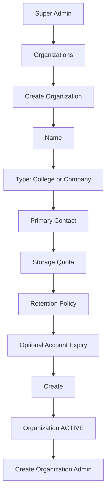
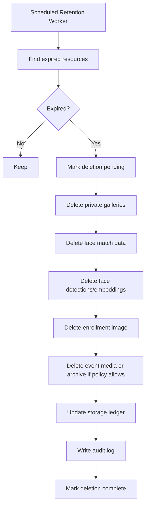
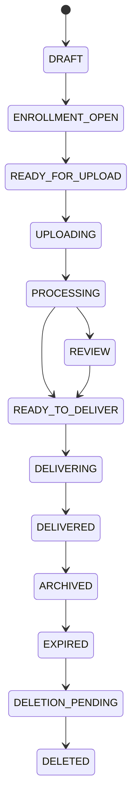
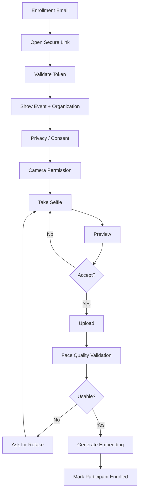
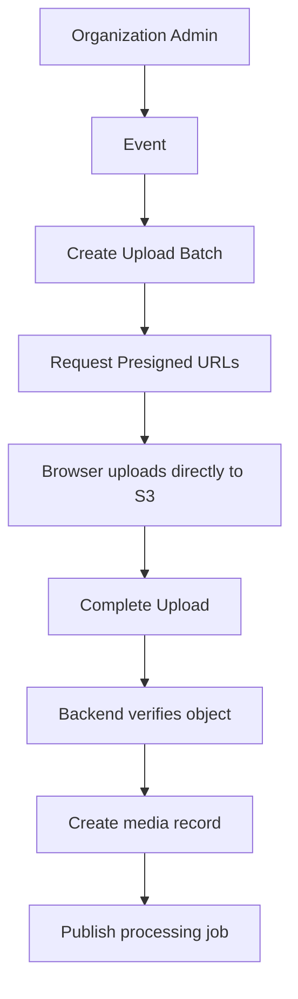
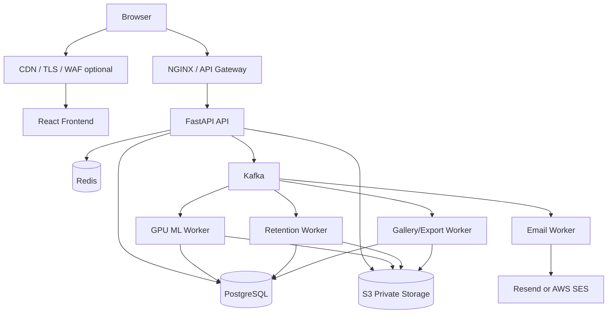
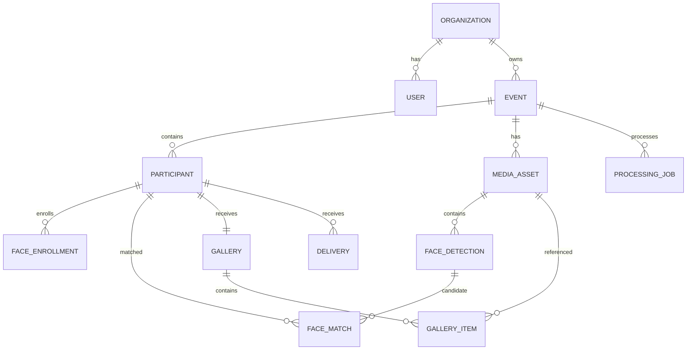
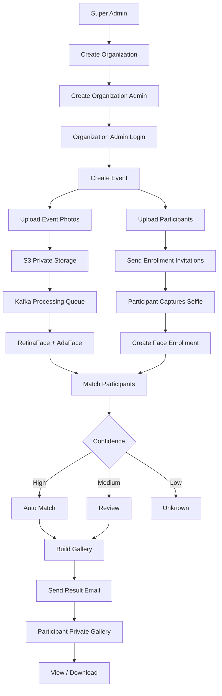
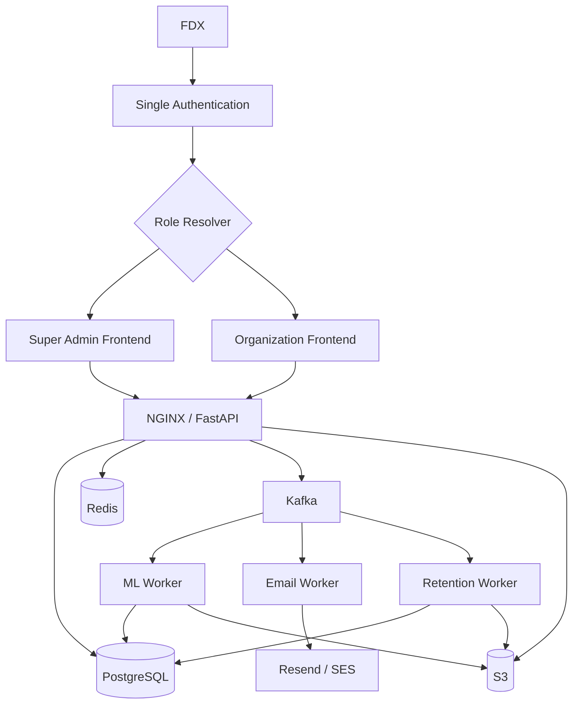

# FDX V2 — Complete Technical Specification

**Document type:** Developer handoff / implementation specification

**Project:** FDX

**Version:** V2

**Status:** Implementation baseline

**Prepared from:** the agreed FDX workflow, the current FDX repository, and the `claude/frontend-super-admin-dashboard-8j5pu7` frontend branch

**Repository:** https://github.com/Dijo-404/FDX
**Frontend branch:** `claude/frontend-super-admin-dashboard-8j5pu7`

---

## 0. Purpose of this document

This document is the complete implementation baseline for FDX V2.

It converts the agreed product workflow into a developer-ready specification covering:

- product scope and workflows
- single-login authentication
- Super Admin and Organization Admin behavior
- multi-tenant isolation
- organization, user, event, participant, upload, matching, gallery, and delivery lifecycles
- database schema
- API endpoints
- Kafka topics and worker jobs
- Redis responsibilities
- S3/object-storage layout
- email flows
- face enrollment
- ML inference and face matching
- data retention and expiry
- storage quotas
- auditing
- security and privacy
- observability
- Docker/runtime structure
- deployment architecture
- CI/CD
- backup and disaster recovery
- failure handling and idempotency
- testing
- migration from the current frontend
- acceptance criteria
- implementation milestones

The intent is that a developer should be able to use this file as the primary technical reference for building FDX V2.

> **Coverage statement:** This specification covers 100% of the requirements discussed for the current FDX V2 scope. Future features not yet discussed are outside this version of the specification.

---

# 1. Product Definition

FDX is a multi-tenant event-photo discovery and delivery platform.

A College or Company creates an event, uploads a list of attendees and event photographs, securely enrolls each attendee's face, processes the event gallery using face detection and recognition, matches attendees with the photographs in which they appear, and privately delivers those photographs to each attendee.

The FDX Super Admin operates the overall platform and manages organizations, organization users, storage limits, retention policies, expiry, platform health, and audit visibility.

The product can be summarized as:

```text
Organization
    ↓
Create Event
    ↓
Upload Participants
    ↓
Invite Participants
    ↓
Participants Enroll Face
    ↓
Upload Event Photos
    ↓
Detect Faces
    ↓
Generate Face Embeddings
    ↓
Match Participants
    ↓
Build Private Galleries
    ↓
Email Results
    ↓
Participant Views / Downloads Photos
```

---

# 2. Core Product Principles

FDX V2 must follow these principles.

1. **One login system**
   - There are not separate authentication systems for Super Admin and College/Company users.
   - A single login endpoint authenticates all platform users.
   - The authenticated role determines the dashboard and permissions.

2. **College and Company are the same backend entity**
   - Backend name: `Organization`
   - `organization_type = COLLEGE | COMPANY`
   - Do not create separate College and Company database models.

3. **Strict tenant isolation**
   - An Organization Admin can only access resources belonging to their own organization.
   - No frontend parameter may override tenant ownership.
   - Tenant filtering must be enforced on the backend.

4. **Participants do not require FDX accounts**
   - Event participants access face enrollment and photo galleries through secure, expiring tokens.

5. **Private-by-default media**
   - Event photos and biometric enrollment images must never be public S3 objects.
   - Access must use authenticated APIs or short-lived signed URLs.

6. **Asynchronous processing**
   - Large photo uploads and ML workloads must run as background jobs.
   - API requests must not remain open for entire event-processing operations.

7. **Auditable actions**
   - Sensitive operations such as login, organization creation, user creation, retention changes, participant imports, face processing, gallery creation, email delivery, and deletion must be logged.

8. **Biometric data minimization**
   - Retain only data required for the active event and policy.
   - Face enrollment images and embeddings must follow retention/deletion rules.

---

# 3. Existing FDX Baseline

The current FDX repository already contains a local face-processing implementation using:

- RetinaFace R50 for face detection
- AdaFace IR101 for face identity embeddings/matching
- ONNX Runtime
- CUDAExecutionProvider when NVIDIA GPU is available
- CPU fallback
- 512-dimensional normalized embeddings
- conservative cosine-similarity matching logic
- support for low-resolution and difficult face crops
- browser-side/current-build matching safeguards

The new frontend branch already contains:

- React
- Vite
- React Router
- `/login`
- protected Super Admin routes under `/admin`
- protected College routes under `/college`
- Super Admin dashboard pages
- College dashboard pages

FDX V2 should preserve the current ML work while replacing the local-only data flow with a proper multi-tenant web platform architecture.

---

# 4. Terminology

| Term | Meaning |
|---|---|
| FDX | The overall platform |
| Super Admin | FDX platform administrator |
| Organization | A College or Company using FDX |
| Organization Admin | User who manages one Organization |
| Participant | Event attendee whose photos are being discovered |
| Event | An Organization-managed event |
| Enrollment | Secure participant face-capture process |
| Event Media | Photos uploaded for an event |
| Face Detection | Face coordinates/landmarks discovered in an image |
| Face Embedding | Numerical identity representation generated by AdaFace |
| Match | Relationship between a participant and a detected face/photo |
| Gallery | Private participant-specific collection of matched photos |
| Delivery | Sending the participant access to their gallery |
| Retention Policy | Rules controlling how long data is stored |
| Storage Quota | Maximum storage allocated to an Organization |
| Tenant | An Organization and its logically isolated resources |

---

# 5. Actors and Roles

## 5.1 Super Admin

The Super Admin manages the FDX platform.

Responsibilities:

- log in through the common login page
- create Organizations
- choose Organization type: College or Company
- create Organization Admin users
- suspend or reactivate Organizations
- view total platform usage
- configure storage quotas
- configure retention periods
- configure account expiry
- view Organization usage
- view system jobs
- view platform audit logs
- inspect failed jobs
- inspect failed email deliveries
- monitor platform health
- initiate administrative cleanup when required

The Super Admin does not need to manage normal event operations.

---

## 5.2 Organization Admin

The Organization Admin manages events belonging to exactly one Organization.

Responsibilities:

- log in through the same login page
- view Organization dashboard
- create/update/archive events
- upload participant lists
- validate participant imports
- send or resend enrollment invitations
- upload event photo folders/batches
- start event processing
- monitor processing progress
- view face-match results
- monitor strict automatic match decisions; manual approval is disabled
- create participant galleries
- send result emails
- view Organization logs
- manage event data according to permissions

---

## 5.3 Participant

A Participant is not a normal authenticated FDX user.

Participant capabilities:

- receive enrollment email
- open secure enrollment link
- read consent/privacy notice
- allow camera access
- capture or upload a face image as permitted
- submit face enrollment
- receive result email
- open private gallery
- view matched photos
- download individual photos
- download all matched photos if enabled
- request deletion where supported by policy

---

# 6. Role Model

Initial V2 roles:

```text
super_admin
org_admin
```

Future-compatible role:

```text
org_staff
```

The initial release does not require `org_staff`, but database and RBAC design should permit adding it later.

Current frontend role name `college` should be migrated to `org_admin`.

---

# 7. Single Login Workflow

```mermaid
flowchart TD
    A[FDX Login] --> B[Email + Password]
    B --> C[POST /api/v2/auth/login]
    C --> D{Valid credentials?}
    D -- No --> E[401 Invalid credentials]
    D -- Yes --> F[Issue Access Token + Refresh Session]
    F --> G{Role}
    G -- super_admin --> H[/admin]
    G -- org_admin --> I[/organization]
```

Requirements:

1. One login form.
2. Backend validates credentials.
3. Backend returns user role and organization context.
4. Frontend routes according to role.
5. Frontend route protection is UX only.
6. Backend performs final authorization on every protected endpoint.

---

# 8. Authentication Design

## 8.1 Recommended authentication model

Use:

- email + password
- Argon2id password hashing
- short-lived JWT access token
- rotating refresh token
- refresh token stored in an HttpOnly, Secure, SameSite cookie
- access token held in memory by the SPA
- explicit logout
- session revocation support
- password reset
- invitation-based account activation

Recommended defaults:

| Setting | Default |
|---|---|
| Access token lifetime | 15 minutes |
| Refresh token lifetime | 7 days |
| Invitation token lifetime | 72 hours |
| Password reset token lifetime | 30 minutes |
| Enrollment link lifetime | 24 hours; reusable until expiry |
| Gallery link lifetime | Configurable; default 7 days |

These values must be environment/configuration driven.

---

## 8.2 JWT claims

Example:

```json
{
  "sub": "user_uuid",
  "role": "org_admin",
  "organization_id": "org_uuid",
  "session_id": "session_uuid",
  "jti": "token_uuid",
  "iat": 1786550000,
  "exp": 1786550900,
  "iss": "fdx",
  "aud": "fdx-web"
}
```

For `super_admin`:

```json
{
  "sub": "user_uuid",
  "role": "super_admin",
  "organization_id": null
}
```

Never trust an `organization_id` supplied by the frontend when the authenticated user's organization is already known.

---

# 9. RBAC Matrix

| Capability | Super Admin | Organization Admin |
|---|---:|---:|
| Login | Yes | Yes |
| View global dashboard | Yes | No |
| Create Organization | Yes | No |
| Update Organization | Yes | No |
| Suspend Organization | Yes | No |
| Delete/close Organization | Yes | No |
| Set storage quota | Yes | No |
| Set retention policy | Yes | No |
| Set account expiry | Yes | No |
| Create Organization Admin | Yes | Optional later |
| View global logs | Yes | No |
| View Organization logs | Yes | Own organization |
| View own Organization dashboard | Optional | Yes |
| Create event | No | Yes |
| Edit event | No | Yes |
| Archive event | Administrative override | Yes |
| Upload participants | No | Yes |
| Send enrollment invitations | No | Yes |
| Upload event photos | No | Yes |
| Start/retry event processing | Administrative override | Yes |
| View matches | Administrative override | Yes |
| Review uncertain matches | Administrative override | Yes |
| Send participant result email | No | Yes |
| Delete event data | Administrative override | Yes, policy controlled |

---

# 10. Multi-Tenant Isolation

Every tenant-owned row must include `organization_id`.

Examples:

- events
- participants
- media
- face enrollments
- detections
- matches
- galleries
- deliveries
- jobs
- logs where applicable

Backend rule:

```text
Authenticated Organization Admin
        ↓
JWT organization_id
        ↓
Every tenant-owned query is scoped to organization_id
```

Incorrect:

```sql
SELECT * FROM events WHERE id = :event_id;
```

Required:

```sql
SELECT *
FROM events
WHERE id = :event_id
  AND organization_id = :authenticated_org_id;
```

Recommended defense in depth:

- application-layer tenant dependency/filter
- PostgreSQL Row Level Security where practical
- S3 object keys containing organization UUID
- Kafka payloads containing organization UUID
- audit logs containing organization UUID
- Redis keys namespaced by organization where tenant-specific

Cross-tenant object references must return `404`, not information revealing that the object exists.

---

# 11. Organization Model

An Organization represents either a College or Company.

Required fields:

```text
id
name
organization_type
primary_email
status
storage_limit_bytes
storage_used_bytes
default_retention_days
account_expires_at
created_at
updated_at
```

Organization types:

```text
COLLEGE
COMPANY
```

Organization statuses:

```text
ACTIVE
SUSPENDED
EXPIRED
DELETION_PENDING
DELETED
```

---

# 12. Organization Creation Workflow



Validation:

- Organization name required.
- Organization type required.
- Primary contact email valid.
- Storage quota > 0.
- Retention days > 0.
- Expiry may be null.
- Duplicate Organization names are allowed only if business rules permit; use UUID as canonical identity.

---

# 13. Organization Admin Invitation Workflow

```text
Super Admin
    ↓
Create Organization Admin
    ↓
Name + Email + Organization
    ↓
Create inactive user
    ↓
Generate single-use invitation token
    ↓
Store token hash
    ↓
Send invitation email
    ↓
User opens link
    ↓
Sets password
    ↓
Account becomes ACTIVE
```

Invitation token rules:

- store only token hash in database
- single use
- expires
- invalidated after password setup
- can be revoked
- new invitation invalidates previous active invitation if configured

---

# 14. Super Admin Dashboard

Required metrics:

- total Organizations
- active Organizations
- suspended Organizations
- total Organization Admin users
- total events
- active events
- total uploaded photos
- total storage used
- storage usage by Organization
- processing jobs queued
- processing jobs running
- failed jobs
- emails sent
- failed emails
- expiring event data
- Organization accounts approaching expiry
- system health summary

Optional but recommended:

- 24-hour job volume
- 7-day media upload volume
- ML worker utilization
- API error rate
- email bounce rate
- top storage consumers

---

# 15. Storage and Expiry Management

Super Admin configures Organization-level defaults:

```text
storage_limit_bytes
default_retention_days
account_expires_at
archive_policy
```

Events can inherit or use a stricter policy.

An Organization Admin must not be able to extend retention beyond the maximum policy allowed by the Super Admin unless explicitly permitted.

---

## 15.1 Expiry workflow



Important:

- expired data must not remain accessible merely because S3 deletion is delayed
- application state should deny access as soon as deletion begins
- cleanup operations must be idempotent
- failures must be retryable

---

# 16. Organization Dashboard

Recommended navigation:

```text
Dashboard
Events
Participants
Uploads
Processing
Face Matches
Deliveries
Logs
Settings
```

The word `Students` must be replaced with `Participants` so the UI supports both Colleges and Companies.

---

# 17. Event Lifecycle

Recommended event states:

```text
DRAFT
ENROLLMENT_OPEN
READY_FOR_UPLOAD
UPLOADING
PROCESSING
REVIEW
READY_TO_DELIVER
DELIVERING
DELIVERED
ARCHIVED
EXPIRED
DELETION_PENDING
DELETED
```

State transitions should be controlled by backend business logic rather than arbitrary frontend updates.

Example:



---

# 18. Event Creation

Required event fields:

```text
id
organization_id
name
description
location
starts_at
ends_at
status
retention_days
enrollment_opens_at
enrollment_closes_at
gallery_expires_at
created_by
created_at
updated_at
```

Minimum UI:

- Event name
- Description
- Date/time
- Location
- Retention period
- Enrollment deadline

---

# 19. Participant Import

Organization Admin uploads a CSV or Excel file.

Required fields:

```text
name
email
```

Optional future fields:

```text
external_id
phone
department
team
registration_number
metadata
```

Example:

```csv
name,email
Dijo,dijo@example.com
John,john@example.com
Alex,alex@example.com
```

---

## 19.1 Import workflow

```text
Upload CSV/XLSX
    ↓
Create participant_import record
    ↓
Parse file
    ↓
Validate required columns
    ↓
Normalize emails
    ↓
Detect duplicate rows
    ↓
Detect duplicate participants in same event
    ↓
Preview validation result
    ↓
Organization Admin confirms
    ↓
Create participants
    ↓
Queue enrollment emails
```

Do not silently discard invalid rows.

Return:

- total rows
- valid rows
- duplicate rows
- invalid rows
- detailed row-level errors

---

# 20. Participant Model

Participant state:

```text
PENDING_INVITE
INVITED
INVITE_FAILED
ENROLLMENT_OPENED
ENROLLED
ENROLLMENT_REJECTED
PROCESSING
MATCHED
NO_MATCH
DELIVERY_PENDING
DELIVERED
DELIVERY_FAILED
EXPIRED
DELETED
```

A participant is event-scoped.

The same email attending multiple events should create separate participant records unless a future cross-event identity feature is explicitly implemented.

This prevents accidental biometric linkage across unrelated events.

---

# 21. Face Enrollment Email

When participants are confirmed:

```text
Participant
    ↓
Create enrollment token
    ↓
Generate secure URL
    ↓
Queue email
    ↓
Email worker sends message
```

Example concept:

```text
Photos from <Event Name> are being processed.

To find photographs containing you, verify your face using the secure link.

[Find My Photos]
```

Do not expose internal participant IDs in URLs.

Recommended route:

```text
https://app.example.com/enroll/<opaque_token>
```

---

# 22. Public Enrollment Workflow

Participants do not create an account.



---

# 23. Enrollment Security Requirements

Enrollment token:

- opaque random value
- at least 128 bits entropy
- store hash only
- scoped to exactly one participant and one event
- expiry time
- revocation time
- consumed status
- rate limited
- no predictable identifiers

The enrollment page must display:

- Organization name
- Event name
- why the face is being collected
- how it is used
- retention/deletion statement
- consent control

Do not proceed until required consent is captured.

---

# 24. Face Enrollment Data

Recommended stored fields:

```text
face_enrollments
----------------
id
organization_id
event_id
participant_id
status
source_media_id
embedding
embedding_model
embedding_version
embedding_dimension
quality_score
detector_confidence
consent_id
created_at
expires_at
deleted_at
```

For AdaFace:

```text
embedding_dimension = 512
embedding_model = adaface-ir101-ms1mv2
metric = cosine
normalization = L2
```

Recommended PostgreSQL implementation:

- enable `pgvector`
- store embedding as `vector(512)`

For event-scale matching, workers may additionally build a temporary in-memory NumPy/FAISS index, but PostgreSQL remains the durable source of truth.

---

# 25. Event Media Upload

Organization Admin can upload:

- folder selection through browser
- many individual files
- optional ZIP upload

For large events, the browser must upload directly to S3 using presigned multipart URLs instead of proxying all image bytes through FastAPI.

---

## 25.1 Upload workflow



---

# 26. Media Validation

Accepted formats for V2:

```text
JPEG
PNG
WEBP
```

Optional future:

```text
HEIC
video
RAW formats
```

Validation:

- MIME type
- extension
- magic bytes
- maximum file size
- decodable image
- pixel dimensions
- checksum
- duplicate detection within event

Recommended checksum:

```text
SHA-256
```

Do not rely only on filename extensions.

---

# 27. S3 / Object Storage Architecture

Use private object storage.

Recommended bucket strategy:

```text
fdx-<environment>-private
```

Example prefixes:

```text
organizations/
  <organization_id>/
    events/
      <event_id>/
        imports/
          <import_id>/participants.csv

        enrollment/
          <participant_id>/
            <enrollment_id>/source.jpg

        media/
          original/
            <media_id>.jpg

          thumbnails/
            <media_id>.webp

        galleries/
          <participant_id>/
            manifest.json

        exports/
          <export_id>.zip
```

Do not use participant names or emails in object keys.

---

## 27.1 S3 requirements

- Block Public Access enabled.
- Encryption at rest.
- Prefer SSE-KMS in production.
- HTTPS only.
- Presigned PUT for uploads.
- Presigned GET for downloads.
- Short signed URL lifetimes.
- Content-Type restrictions.
- Optional Content-MD5/checksum validation.
- Versioning policy decided per environment.
- Lifecycle rules controlled by FDX retention logic.
- Access logs/CloudTrail data events where required.

---

## 27.2 Glacier / archival policy

The original architecture included Glacier/cold storage.

FDX V2 rule:

- Glacier is optional.
- Archive only when the Organization's policy explicitly permits it.
- A deletion policy must delete, not archive, biometric/event data.
- Cold archival must never be used to bypass an expiry/deletion requirement.

Possible lifecycle:

```text
Original photo
  ↓
Active S3
  ↓ after configured age
S3 Glacier storage class
  ↓ at final retention deadline
Permanent deletion
```

---

# 28. Storage Quota Enforcement

Before accepting a new upload:

```text
current_usage + reserved_upload_bytes <= storage_limit
```

Use a reservation model for multipart/batch uploads.

Tables:

```text
storage_usage_ledger
storage_reservations
```

States:

```text
RESERVED
COMMITTED
RELEASED
EXPIRED
```

This prevents concurrent uploads from exceeding the quota.

Return HTTP `413` or domain-specific `409` when quota is exceeded.

---

# 29. ML Processing Pipeline

Core pipeline:

```text
Photo
  ↓
Decode
  ↓
RetinaFace R50
  ↓
Face boxes + landmarks
  ↓
Quality / size checks
  ↓
Alignment
  ↓
AdaFace IR101
  ↓
512-d L2-normalized embeddings
  ↓
Compare with enrolled participant embeddings
  ↓
Candidate scores
  ↓
Confidence policy
  ↓
Accepted / Review / Unknown
```

---

# 30. Current ML Baseline to Preserve

Current FDX has conservative matching behavior.

The production service should preserve the current algorithmic safety philosophy:

- RetinaFace R50 detection
- AdaFace IR101 embedding
- cosine similarity
- normalized embeddings
- unknown by default when confidence is insufficient
- stricter handling for low-resolution faces
- runner-up margin checks
- avoidance of weak identity expansion when competing identities exist
- model/version-aware cache invalidation
- explicit model version recording

Current local thresholds may be used as an initial engineering baseline, but they must be configurable and calibrated using genuine and impostor pairs from the actual deployment camera/event data before production acceptance.

---

# 31. Suggested Matching Policy

FDX V2 should use three output classes:

```text
AUTO_MATCH
REVIEW_REQUIRED
UNKNOWN
```

Example configurable policy:

```text
auto_match_threshold
review_threshold
runner_up_margin
low_resolution_threshold
minimum_face_size
minimum_detector_confidence
```

Decision example:

```text
score >= auto_match_threshold
AND score - second_best_score >= runner_up_margin
    => AUTO_MATCH

score >= review_threshold
    => REVIEW_REQUIRED

otherwise
    => UNKNOWN
```

Never expose a raw similarity score to participants as a probability.

---

# 32. Match Storage

Store candidate/result information for reproducibility.

```text
face_matches
------------
id
organization_id
event_id
participant_id
face_detection_id
media_id
similarity_score
second_best_score
margin
decision
decision_source
model_name
model_version
threshold_profile_version
created_at
reviewed_by
reviewed_at
```

`decision_source`:

```text
AUTO
MANUAL_CONFIRM
MANUAL_REJECT
REPROCESS
```

---

# 33. Manual Review

For medium-confidence matches:

Organization Admin can view:

- event photo
- detected face crop
- participant enrollment reference
- similarity score
- competing candidate score
- model/version
- automatic threshold decision

Requirements:

- only automatic high-confidence matches enter participant galleries
- below-threshold matches remain unknown and cannot be manually overridden
- threshold profile and model versions are stored with every decision
- no cross-Organization participant comparisons

---

# 34. Processing Jobs

Use a durable database row for every significant background job.

```text
processing_jobs
---------------
id
organization_id
event_id
job_type
resource_type
resource_id
status
attempt
max_attempts
progress_current
progress_total
error_code
error_message
queued_at
started_at
finished_at
heartbeat_at
```

Statuses:

```text
QUEUED
RUNNING
SUCCEEDED
FAILED
RETRY_SCHEDULED
CANCEL_REQUESTED
CANCELLED
DEAD_LETTERED
```

---

# 35. Kafka Architecture

Kafka is used for durable asynchronous event processing.

Recommended topic prefix:

```text
fdx.v2.
```

Required topics:

| Topic | Purpose | Key |
|---|---|---|
| `fdx.v2.media.ready` | New verified event media is ready | `media_id` |
| `fdx.v2.ml.process.requested` | Request detection + embedding | `media_id` |
| `fdx.v2.ml.process.completed` | Detection/embedding finished | `media_id` |
| `fdx.v2.match.requested` | Request matching for detected faces | `event_id` |
| `fdx.v2.match.completed` | Matching operation finished | `event_id` |
| `fdx.v2.gallery.build.requested` | Build participant galleries | `participant_id` |
| `fdx.v2.gallery.build.completed` | Gallery ready | `participant_id` |
| `fdx.v2.email.send.requested` | Send transactional email | `email_message_id` |
| `fdx.v2.email.status` | Provider/delivery updates | `email_message_id` |
| `fdx.v2.retention.cleanup.requested` | Cleanup expired resources | `resource_id` |
| `fdx.v2.audit.event` | Optional audit event stream | `organization_id` |

Each retryable processing topic should have a DLQ strategy.

Examples:

```text
fdx.v2.ml.process.dlq
fdx.v2.email.send.dlq
fdx.v2.retention.cleanup.dlq
```

---

# 36. Kafka Message Envelope

All events should use a common envelope.

```json
{
  "event_id": "uuid",
  "event_type": "fdx.v2.ml.process.requested",
  "event_version": 1,
  "occurred_at": "2026-08-13T00:00:00Z",
  "correlation_id": "uuid",
  "organization_id": "uuid",
  "actor_type": "USER",
  "actor_id": "uuid",
  "payload": {}
}
```

Required:

- unique `event_id`
- versioned schema
- timestamp
- correlation ID
- tenant ID when tenant-owned
- idempotent consumers

Do not place images or embeddings directly into Kafka messages.

Send object/database references instead.

---

# 37. Kafka Delivery Semantics

Assume at-least-once delivery.

Therefore every consumer must be idempotent.

Example:

```text
Receive ml.process.requested(media_id)
    ↓
Check processing result already exists for model version
    ↓
Yes → acknowledge without reprocessing
No → process
```

Use the database transaction + outbox pattern for important state changes that must publish Kafka events reliably.

---

# 38. Transactional Outbox

Recommended table:

```text
outbox_events
-------------
id
aggregate_type
aggregate_id
organization_id
event_type
event_version
payload_json
created_at
published_at
publish_attempts
```

Flow:

1. API updates business state.
2. API inserts outbox event in same database transaction.
3. Outbox publisher sends event to Kafka.
4. Publisher marks row published.
5. Duplicate publishes remain safe because consumers are idempotent.

---

# 39. Redis Responsibilities

Redis is not the source of truth.

PostgreSQL remains durable storage.

Redis responsibilities:

### 39.1 Rate limiting

Examples:

```text
rate:login:<ip>
rate:enroll:<token_hash_prefix>
rate:api:<user_id>
rate:email:<organization_id>
```

### 39.2 Distributed locks

```text
lock:event:<event_id>:processing
lock:media:<media_id>:ml
lock:participant:<participant_id>:gallery
lock:retention:<resource_id>
```

### 39.3 Cache

```text
cache:org:<organization_id>:policy
cache:user:<user_id>:permissions
cache:event:<event_id>:summary
```

### 39.4 Processing progress

```text
progress:event:<event_id>
```

Use Redis for fast progress display; periodically persist important progress to PostgreSQL.

### 39.5 Token/session revocation

```text
revoked:jti:<jti>
```

Can be used for access-token emergency revocation.

### 39.6 Idempotency

Short-lived endpoint idempotency records:

```text
idem:<user_id>:<key>
```

Never store the only copy of a critical business record in Redis.

---

# 40. Email Architecture

Use a provider abstraction:

```text
EmailService
   ├── Resend adapter
   └── AWS SES adapter
```

Choose one provider as primary per environment.

Do not require both providers to be active.

Recommended:

- Resend for simpler initial transactional delivery, or
- AWS SES for AWS-native production deployment

The application must not depend directly on provider-specific code outside the email adapter.

---

# 41. Required Email Types

## 41.1 Organization Admin invitation

Purpose:

- activate FDX account
- set initial password

## 41.2 Participant enrollment invitation

Purpose:

- explain event
- provide secure enrollment link

## 41.3 Enrollment reminder

Optional configured reminders to participants who have not enrolled.

## 41.4 Photos ready

Purpose:

- notify participant that matches are available
- link to private gallery

## 41.5 Delivery retry/failure operational alert

Visible to Organization Admin or Super Admin when delivery repeatedly fails.

## 41.6 Password reset

Standard authenticated-user password recovery.

## 41.7 Organization expiry warning

Sent before account expiry.

## 41.8 Event-data expiry warning

Optional notification before scheduled deletion.

---

# 42. Email Message Model

```text
email_messages
--------------
id
organization_id
event_id
participant_id
user_id
template
recipient_email
provider
provider_message_id
status
attempt_count
last_error
queued_at
sent_at
delivered_at
failed_at
```

Statuses:

```text
QUEUED
SENDING
SENT
DELIVERED
BOUNCED
FAILED
SUPPRESSED
```

---

# 43. Email Idempotency

The same logical email must not be accidentally sent repeatedly.

Example unique logical key:

```text
participant_id + template + template_version + event_id + delivery_generation
```

Manual "Resend" creates a new delivery generation.

---

# 44. Private Participant Gallery

When matches are ready:

```text
Participant
    ↓
Matched photos
    ↓
Create/update gallery manifest
    ↓
Generate access token
    ↓
Send photos-ready email
```

The gallery should contain only photos matched to that participant.

A single event photo may be present in multiple participant galleries.

Do not physically duplicate original images for every gallery unless needed for exports.

Store gallery relationships instead.

---

# 45. Gallery Access

Recommended route:

```text
https://app.example.com/gallery/<opaque_token>
```

Token:

- random
- hash stored server side
- scoped to participant + event
- expires
- revocable
- rate limited

Gallery API returns signed image URLs only for media the participant is authorized to view.

---

# 46. Gallery Features

Required:

- event name
- Organization name
- thumbnail grid
- full image view
- download single image
- optional download selected
- optional download all
- expiry message

Recommended:

- no participant names embedded in URLs
- no public S3 links
- prevent directory indexing
- signed URL expiry: approximately 5–15 minutes
- gallery token may last longer than individual S3 URLs

---

# 47. Database Technology

Recommended:

```text
PostgreSQL 15+
SQLAlchemy 2.x
Alembic
Pydantic 2.x
pgvector
```

The exact deployed versions must be pinned in dependency files.

Use UUID primary keys.

Use UTC timestamps.

Use `TIMESTAMPTZ`.

Use soft-delete fields only where recovery/audit requirements justify them; expired biometric/media data must still be physically deleted according to policy.

---

# 48. Core Database Schema

## 48.1 `organizations`

```text
id UUID PK
name VARCHAR NOT NULL
organization_type ENUM(COLLEGE, COMPANY) NOT NULL
primary_email CITEXT NOT NULL
status ENUM NOT NULL
storage_limit_bytes BIGINT NOT NULL
storage_used_bytes BIGINT NOT NULL DEFAULT 0
default_retention_days INTEGER NOT NULL
account_expires_at TIMESTAMPTZ NULL
created_at TIMESTAMPTZ NOT NULL
updated_at TIMESTAMPTZ NOT NULL
deleted_at TIMESTAMPTZ NULL
```

Indexes:

```text
(status)
(account_expires_at)
(lower(name))
```

---

## 48.2 `users`

```text
id UUID PK
organization_id UUID NULL FK organizations(id)
email CITEXT UNIQUE NOT NULL
name VARCHAR NOT NULL
password_hash TEXT NULL
role ENUM(super_admin, org_admin) NOT NULL
status ENUM(INVITED, ACTIVE, SUSPENDED, DISABLED) NOT NULL
last_login_at TIMESTAMPTZ NULL
created_at TIMESTAMPTZ NOT NULL
updated_at TIMESTAMPTZ NOT NULL
```

Constraints:

- `super_admin` must have `organization_id = NULL`
- `org_admin` must have `organization_id IS NOT NULL`

---

## 48.3 `user_invitations`

```text
id UUID PK
user_id UUID FK users(id)
token_hash TEXT UNIQUE NOT NULL
expires_at TIMESTAMPTZ NOT NULL
accepted_at TIMESTAMPTZ NULL
revoked_at TIMESTAMPTZ NULL
created_at TIMESTAMPTZ NOT NULL
```

---

## 48.4 `refresh_sessions`

```text
id UUID PK
user_id UUID FK users(id)
refresh_token_hash TEXT NOT NULL
user_agent TEXT NULL
ip_address INET NULL
expires_at TIMESTAMPTZ NOT NULL
revoked_at TIMESTAMPTZ NULL
created_at TIMESTAMPTZ NOT NULL
last_used_at TIMESTAMPTZ NULL
```

---

## 48.5 `events`

```text
id UUID PK
organization_id UUID FK organizations(id) NOT NULL
name VARCHAR NOT NULL
description TEXT NULL
location VARCHAR NULL
starts_at TIMESTAMPTZ NULL
ends_at TIMESTAMPTZ NULL
status ENUM NOT NULL
retention_days INTEGER NOT NULL
enrollment_opens_at TIMESTAMPTZ NULL
enrollment_closes_at TIMESTAMPTZ NULL
gallery_expires_at TIMESTAMPTZ NULL
expires_at TIMESTAMPTZ NOT NULL
created_by UUID FK users(id)
created_at TIMESTAMPTZ NOT NULL
updated_at TIMESTAMPTZ NOT NULL
deleted_at TIMESTAMPTZ NULL
```

Indexes:

```text
(organization_id, status)
(organization_id, created_at DESC)
(expires_at)
```

---

## 48.6 `participant_imports`

```text
id UUID PK
organization_id UUID NOT NULL
event_id UUID NOT NULL
source_object_key TEXT NOT NULL
status ENUM(UPLOADED, VALIDATING, READY, CONFIRMED, FAILED)
total_rows INTEGER DEFAULT 0
valid_rows INTEGER DEFAULT 0
invalid_rows INTEGER DEFAULT 0
duplicate_rows INTEGER DEFAULT 0
validation_report JSONB NULL
created_by UUID NOT NULL
created_at TIMESTAMPTZ NOT NULL
confirmed_at TIMESTAMPTZ NULL
```

---

## 48.7 `participants`

```text
id UUID PK
organization_id UUID NOT NULL
event_id UUID NOT NULL
name VARCHAR NOT NULL
email CITEXT NOT NULL
external_id VARCHAR NULL
status ENUM NOT NULL
enrollment_status ENUM NOT NULL
delivery_status ENUM NOT NULL
created_at TIMESTAMPTZ NOT NULL
updated_at TIMESTAMPTZ NOT NULL
deleted_at TIMESTAMPTZ NULL
```

Recommended unique index:

```text
UNIQUE(event_id, lower(email))
```

---

## 48.8 `participant_enrollment_tokens`

```text
id UUID PK
participant_id UUID NOT NULL
token_hash TEXT UNIQUE NOT NULL
expires_at TIMESTAMPTZ NOT NULL
opened_at TIMESTAMPTZ NULL
consumed_at TIMESTAMPTZ NULL
revoked_at TIMESTAMPTZ NULL
created_at TIMESTAMPTZ NOT NULL
```

---

## 48.9 `consents`

```text
id UUID PK
organization_id UUID NOT NULL
event_id UUID NOT NULL
participant_id UUID NOT NULL
consent_type VARCHAR NOT NULL
policy_version VARCHAR NOT NULL
accepted BOOLEAN NOT NULL
accepted_at TIMESTAMPTZ NOT NULL
ip_address INET NULL
user_agent TEXT NULL
```

---

## 48.10 `upload_batches`

```text
id UUID PK
organization_id UUID NOT NULL
event_id UUID NOT NULL
status ENUM(CREATED, UPLOADING, VERIFYING, COMPLETE, FAILED, CANCELLED)
expected_files INTEGER NULL
uploaded_files INTEGER DEFAULT 0
reserved_bytes BIGINT DEFAULT 0
committed_bytes BIGINT DEFAULT 0
created_by UUID NOT NULL
created_at TIMESTAMPTZ NOT NULL
completed_at TIMESTAMPTZ NULL
```

---

## 48.11 `media_assets`

Used for event photos and enrollment images.

```text
id UUID PK
organization_id UUID NOT NULL
event_id UUID NOT NULL
participant_id UUID NULL
upload_batch_id UUID NULL
media_type ENUM(EVENT_PHOTO, ENROLLMENT_IMAGE, THUMBNAIL, EXPORT)
storage_key TEXT UNIQUE NOT NULL
original_filename TEXT NULL
mime_type VARCHAR NOT NULL
size_bytes BIGINT NOT NULL
width INTEGER NULL
height INTEGER NULL
sha256 CHAR(64) NOT NULL
status ENUM(UPLOADED, VERIFIED, PROCESSING, READY, FAILED, DELETED)
created_at TIMESTAMPTZ NOT NULL
deleted_at TIMESTAMPTZ NULL
```

Indexes:

```text
(organization_id, event_id)
(event_id, sha256)
(status)
```

---

## 48.12 `face_enrollments`

```text
id UUID PK
organization_id UUID NOT NULL
event_id UUID NOT NULL
participant_id UUID NOT NULL
source_media_id UUID NOT NULL
status ENUM(PENDING, VALID, REJECTED, EXPIRED, DELETED)
embedding vector(512) NULL
model_name VARCHAR NOT NULL
model_version VARCHAR NOT NULL
quality_score REAL NULL
detector_confidence REAL NULL
created_at TIMESTAMPTZ NOT NULL
expires_at TIMESTAMPTZ NOT NULL
deleted_at TIMESTAMPTZ NULL
```

---

## 48.13 `face_detections`

```text
id UUID PK
organization_id UUID NOT NULL
event_id UUID NOT NULL
media_id UUID NOT NULL
face_index INTEGER NOT NULL
bbox JSONB NOT NULL
landmarks JSONB NULL
detector_confidence REAL NOT NULL
face_width INTEGER NULL
face_height INTEGER NULL
quality_class ENUM(GOOD, LOW_RESOLUTION, REJECTED)
embedding vector(512) NULL
model_name VARCHAR NOT NULL
model_version VARCHAR NOT NULL
created_at TIMESTAMPTZ NOT NULL
```

Unique:

```text
UNIQUE(media_id, face_index, model_name, model_version)
```

---

## 48.14 `face_matches`

```text
id UUID PK
organization_id UUID NOT NULL
event_id UUID NOT NULL
participant_id UUID NOT NULL
face_detection_id UUID NOT NULL
media_id UUID NOT NULL
similarity_score REAL NOT NULL
second_best_score REAL NULL
margin REAL NULL
decision ENUM(AUTO_MATCH, REVIEW_REQUIRED, UNKNOWN, CONFIRMED, REJECTED)
decision_source ENUM(AUTO, MANUAL_CONFIRM, MANUAL_REJECT, REPROCESS)
threshold_profile_version VARCHAR NOT NULL
model_name VARCHAR NOT NULL
model_version VARCHAR NOT NULL
reviewed_by UUID NULL
reviewed_at TIMESTAMPTZ NULL
created_at TIMESTAMPTZ NOT NULL
```

---

## 48.15 `galleries`

```text
id UUID PK
organization_id UUID NOT NULL
event_id UUID NOT NULL
participant_id UUID NOT NULL
status ENUM(BUILDING, READY, DELIVERED, EXPIRED, REVOKED, DELETED)
access_token_hash TEXT UNIQUE NULL
access_expires_at TIMESTAMPTZ NULL
created_at TIMESTAMPTZ NOT NULL
updated_at TIMESTAMPTZ NOT NULL
```

Unique:

```text
UNIQUE(event_id, participant_id)
```

---

## 48.16 `gallery_items`

```text
id UUID PK
gallery_id UUID NOT NULL
media_id UUID NOT NULL
match_id UUID NOT NULL
created_at TIMESTAMPTZ NOT NULL
```

Unique:

```text
UNIQUE(gallery_id, media_id)
```

---

## 48.17 `email_messages`

As defined in the email section.

---

## 48.18 `deliveries`

```text
id UUID PK
organization_id UUID NOT NULL
event_id UUID NOT NULL
participant_id UUID NOT NULL
gallery_id UUID NULL
delivery_type ENUM(ENROLLMENT_INVITE, RESULT_GALLERY)
status ENUM(PENDING, SENT, DELIVERED, FAILED)
email_message_id UUID NULL
attempt INTEGER NOT NULL DEFAULT 0
created_at TIMESTAMPTZ NOT NULL
delivered_at TIMESTAMPTZ NULL
```

---

## 48.19 `processing_jobs`

As defined in the job section.

---

## 48.20 `storage_usage_ledger`

```text
id UUID PK
organization_id UUID NOT NULL
event_id UUID NULL
media_id UUID NULL
operation ENUM(ADD, DELETE, RESERVE, RELEASE, ARCHIVE)
bytes BIGINT NOT NULL
created_at TIMESTAMPTZ NOT NULL
```

---

## 48.21 `audit_logs`

```text
id UUID PK
organization_id UUID NULL
actor_type ENUM(USER, PARTICIPANT, SYSTEM, WORKER)
actor_id UUID NULL
action VARCHAR NOT NULL
resource_type VARCHAR NULL
resource_id UUID NULL
request_id UUID NULL
ip_address INET NULL
user_agent TEXT NULL
metadata JSONB NULL
created_at TIMESTAMPTZ NOT NULL
```

Audit logs should be append-only to application users.

---

## 48.22 `outbox_events`

As defined earlier.

---

# 49. API Conventions

Base path:

```text
/api/v2
```

Content type:

```text
application/json
```

Except:

- CSV/XLSX import
- image uploads where direct upload is necessary
- webhook provider payloads

Use UUIDs in API payloads.

All timestamps:

```text
ISO 8601 UTC
```

Example:

```text
2026-08-12T18:30:00Z
```

---

# 50. Standard API Response

Success:

```json
{
  "data": {},
  "meta": {
    "request_id": "uuid"
  }
}
```

List:

```json
{
  "data": [],
  "meta": {
    "request_id": "uuid",
    "page": 1,
    "page_size": 50,
    "total": 250
  }
}
```

Error:

```json
{
  "error": {
    "code": "EVENT_NOT_FOUND",
    "message": "Event was not found.",
    "details": {}
  },
  "meta": {
    "request_id": "uuid"
  }
}
```

---

# 51. HTTP Status Policy

| Status | Use |
|---|---|
| 200 | Successful read/update |
| 201 | Created |
| 202 | Async job accepted |
| 204 | Successful no-content operation |
| 400 | Malformed request |
| 401 | Authentication required/invalid |
| 403 | Authenticated but forbidden |
| 404 | Resource not found or not visible in tenant |
| 409 | State conflict/idempotency conflict |
| 413 | Upload/quota too large |
| 422 | Validation error |
| 429 | Rate limited |
| 500 | Unexpected server error |
| 503 | Dependency temporarily unavailable |

---

# 52. Authentication API

## `POST /api/v2/auth/login`

Request:

```json
{
  "email": "admin@example.com",
  "password": "secret"
}
```

Response:

```json
{
  "data": {
    "access_token": "<jwt>",
    "expires_in": 900,
    "user": {
      "id": "uuid",
      "name": "Name",
      "email": "admin@example.com",
      "role": "org_admin",
      "organization_id": "uuid"
    },
    "redirect_to": "/organization"
  }
}
```

Refresh token is set as secure HttpOnly cookie.

---

## `POST /api/v2/auth/refresh`

Rotates refresh token and returns new access token.

---

## `POST /api/v2/auth/logout`

Revokes current refresh session.

---

## `GET /api/v2/auth/me`

Returns current authenticated user and tenant context.

---

## `POST /api/v2/auth/forgot-password`

Queues password reset email.

Always use non-enumerating response.

---

## `POST /api/v2/auth/reset-password`

Consumes reset token and sets new password.

---

## `POST /api/v2/auth/invitations/{token}/accept`

Sets initial password and activates invited Organization Admin.

---

# 53. Super Admin API

## Dashboard

```text
GET /api/v2/admin/dashboard
GET /api/v2/admin/system-health
GET /api/v2/admin/jobs
GET /api/v2/admin/jobs/{job_id}
POST /api/v2/admin/jobs/{job_id}/retry
GET /api/v2/admin/logs
```

---

## Organizations

```text
GET    /api/v2/admin/organizations
POST   /api/v2/admin/organizations
GET    /api/v2/admin/organizations/{organization_id}
PATCH  /api/v2/admin/organizations/{organization_id}
POST   /api/v2/admin/organizations/{organization_id}/suspend
POST   /api/v2/admin/organizations/{organization_id}/activate
POST   /api/v2/admin/organizations/{organization_id}/schedule-deletion
```

---

## Organization policy

```text
GET /api/v2/admin/organizations/{organization_id}/storage
PUT /api/v2/admin/organizations/{organization_id}/storage

GET /api/v2/admin/organizations/{organization_id}/retention
PUT /api/v2/admin/organizations/{organization_id}/retention
```

---

## Organization users

```text
GET   /api/v2/admin/organizations/{organization_id}/users
POST  /api/v2/admin/organizations/{organization_id}/users
GET   /api/v2/admin/users/{user_id}
PATCH /api/v2/admin/users/{user_id}
POST  /api/v2/admin/users/{user_id}/suspend
POST  /api/v2/admin/users/{user_id}/activate
POST  /api/v2/admin/users/{user_id}/resend-invite
```

---

# 54. Organization API

```text
GET /api/v2/organization
GET /api/v2/organization/dashboard
GET /api/v2/organization/usage
GET /api/v2/organization/logs
```

All derive organization from authenticated user.

Do not accept an organization ID for normal Organization Admin operations unless the backend still verifies ownership.

---

# 55. Event API

```text
GET    /api/v2/events
POST   /api/v2/events
GET    /api/v2/events/{event_id}
PATCH  /api/v2/events/{event_id}
POST   /api/v2/events/{event_id}/open-enrollment
POST   /api/v2/events/{event_id}/close-enrollment
POST   /api/v2/events/{event_id}/start-processing
POST   /api/v2/events/{event_id}/cancel-processing
POST   /api/v2/events/{event_id}/archive
DELETE /api/v2/events/{event_id}
```

`DELETE` should normally schedule controlled deletion rather than synchronously deleting thousands of objects.

---

# 56. Participant Import API

```text
POST /api/v2/events/{event_id}/participant-imports
GET  /api/v2/events/{event_id}/participant-imports
GET  /api/v2/events/{event_id}/participant-imports/{import_id}
POST /api/v2/events/{event_id}/participant-imports/{import_id}/confirm
```

For large import file:

1. request upload URL
2. upload directly to S3
3. confirm object
4. queue validation

---

# 57. Participants API

```text
GET    /api/v2/events/{event_id}/participants
POST   /api/v2/events/{event_id}/participants
GET    /api/v2/events/{event_id}/participants/{participant_id}
PATCH  /api/v2/events/{event_id}/participants/{participant_id}
DELETE /api/v2/events/{event_id}/participants/{participant_id}

POST /api/v2/events/{event_id}/participants/{participant_id}/send-invite
POST /api/v2/events/{event_id}/participants/{participant_id}/resend-invite
POST /api/v2/events/{event_id}/participants/send-invites
```

Bulk invitation endpoint should accept filters, not thousands of IDs if avoidable.

---

# 58. Public Enrollment API

Unauthenticated but token-protected:

```text
GET  /api/v2/public/enrollment/{token}
POST /api/v2/public/enrollment/{token}/consent
POST /api/v2/public/enrollment/{token}/upload-url
POST /api/v2/public/enrollment/{token}/complete
```

`GET` returns only safe event/Organization information.

Never return participant list or internal Organization data.

---

# 59. Event Media API

```text
POST /api/v2/events/{event_id}/upload-batches
GET  /api/v2/events/{event_id}/upload-batches
GET  /api/v2/events/{event_id}/upload-batches/{batch_id}

POST /api/v2/events/{event_id}/upload-batches/{batch_id}/presign
POST /api/v2/events/{event_id}/upload-batches/{batch_id}/complete
POST /api/v2/events/{event_id}/upload-batches/{batch_id}/cancel

GET    /api/v2/events/{event_id}/media
GET    /api/v2/events/{event_id}/media/{media_id}
DELETE /api/v2/events/{event_id}/media/{media_id}
POST   /api/v2/events/{event_id}/media/{media_id}/reprocess
```

---

# 60. Processing API

```text
GET  /api/v2/events/{event_id}/processing
GET  /api/v2/events/{event_id}/processing/jobs
GET  /api/v2/events/{event_id}/processing/jobs/{job_id}
POST /api/v2/events/{event_id}/processing/jobs/{job_id}/retry
```

Response should include:

```text
photos_total
photos_processed
photos_failed
faces_detected
matches_auto
matches_review
matches_unknown
progress_percent
estimated_remaining optional
```

Do not promise an ETA unless based on measured throughput.

---

# 61. Face Match API

```text
GET  /api/v2/events/{event_id}/matches
GET  /api/v2/events/{event_id}/matches/{match_id}
POST /api/v2/events/{event_id}/matches/{match_id}/confirm
POST /api/v2/events/{event_id}/matches/{match_id}/reject
```

Filters:

```text
participant_id
media_id
decision
minimum_score
review_required
```

---

# 62. Delivery / Gallery API

```text
POST /api/v2/events/{event_id}/galleries/build
GET  /api/v2/events/{event_id}/galleries
GET  /api/v2/events/{event_id}/galleries/{gallery_id}

POST /api/v2/events/{event_id}/deliveries/send
GET  /api/v2/events/{event_id}/deliveries
POST /api/v2/events/{event_id}/participants/{participant_id}/resend-results
```

Public:

```text
GET  /api/v2/public/gallery/{token}
POST /api/v2/public/gallery/{token}/download-url
POST /api/v2/public/gallery/{token}/download-all
```

---

# 63. Email Provider Webhooks

Example:

```text
POST /api/v2/webhooks/email/resend
POST /api/v2/webhooks/email/ses
```

Only enable the active provider endpoint.

Webhook requirements:

- verify provider signature
- idempotent processing
- store provider event ID
- update email status
- audit repeated failures
- do not trust unverified payloads

---

# 64. Backend Service Structure

Recommended initial architecture: modular monolith + separate workers.

This is preferred over immediately splitting every module into microservices.

```text
FastAPI API
    ├── auth
    ├── organizations
    ├── users
    ├── events
    ├── participants
    ├── uploads
    ├── galleries
    ├── deliveries
    ├── retention
    ├── audit
    └── admin

Workers
    ├── ML worker
    ├── Email worker
    ├── Retention worker
    ├── Thumbnail/export worker
    └── Outbox publisher
```

The ML worker can be deployed on GPU machines independently of the API.

---

# 65. Suggested Backend Repository Layout

```text
backend/
├── app/
│   ├── main.py
│   ├── api/
│   │   └── v2/
│   │       ├── auth.py
│   │       ├── admin.py
│   │       ├── organizations.py
│   │       ├── events.py
│   │       ├── participants.py
│   │       ├── uploads.py
│   │       ├── matches.py
│   │       ├── galleries.py
│   │       ├── deliveries.py
│   │       ├── public.py
│   │       └── webhooks.py
│   ├── core/
│   │   ├── config.py
│   │   ├── security.py
│   │   ├── logging.py
│   │   ├── tenant.py
│   │   └── errors.py
│   ├── db/
│   │   ├── base.py
│   │   ├── session.py
│   │   └── models/
│   ├── schemas/
│   ├── services/
│   ├── repositories/
│   ├── kafka/
│   ├── redis/
│   ├── storage/
│   ├── email/
│   └── audit/
├── workers/
│   ├── ml/
│   ├── email/
│   ├── retention/
│   └── outbox/
├── migrations/
├── tests/
├── pyproject.toml
└── Dockerfile
```

---

# 66. ML Worker Structure

Recommended:

```text
workers/ml/
├── worker.py
├── detector.py
├── embedder.py
├── align.py
├── quality.py
├── matcher.py
├── thresholds.py
├── model_registry.py
├── schemas.py
└── tests/
```

The current local inference implementation should be refactored into these reusable components rather than rewritten from scratch without reason.

---

# 67. Model Registry

Record model metadata centrally.

Example:

```text
model_registry
--------------
detector_name
detector_version
detector_sha256
embedder_name
embedder_version
embedder_sha256
embedding_dimension
metric
threshold_profile_version
activated_at
```

Every detection/match result must be reproducible back to a model/version.

A model upgrade must not compare incompatible embedding spaces.

---

# 68. Caching and Model Upgrade Rules

When a model/version changes:

- do not treat old cached detection results as equivalent unless explicitly compatible
- do not compare ArcFace and AdaFace embeddings
- invalidate affected caches
- mark old processing version
- reprocess event if required
- keep audit/history required for traceability until retention expiry

---

# 69. Frontend Technical Direction

Current branch uses React + Vite + React Router.

V2 should retain the existing frontend as the UI baseline.

Recommended route migration:

```text
/login

/admin
/admin/organizations
/admin/organizations/:id
/admin/users
/admin/storage
/admin/jobs
/admin/logs

/organization
/organization/events
/organization/events/:eventId
/organization/events/:eventId/participants
/organization/events/:eventId/uploads
/organization/events/:eventId/processing
/organization/events/:eventId/matches
/organization/events/:eventId/deliveries
/organization/logs
/organization/settings

/enroll/:token
/gallery/:token
```

Current `/college` may temporarily redirect to `/organization`.

---

# 70. Frontend State

Recommended responsibilities:

- auth provider
- access token in memory
- current user
- role
- Organization summary
- global API client
- route guards
- request error handling
- upload manager
- processing progress polling or SSE/WebSocket

For initial V2, polling every 2–5 seconds for active processing is acceptable.

SSE/WebSocket may be added later.

---

# 71. NGINX / Reverse Proxy

NGINX responsibilities:

- TLS termination if not handled upstream
- route frontend/API
- request body limits for small API uploads
- rate limiting where appropriate
- security headers
- compression
- proxy timeout configuration
- request ID propagation

Large event media should bypass NGINX/FastAPI data transfer through direct S3 upload.

---

# 72. Security Headers

Recommended:

```text
Strict-Transport-Security
Content-Security-Policy
X-Content-Type-Options: nosniff
Referrer-Policy
Permissions-Policy
```

Camera permission should be permitted only for the enrollment page/origin.

Use secure cookie attributes in production.

---

# 73. Rate Limiting

Minimum policies:

- login attempts by IP + account
- password reset
- invitation acceptance
- enrollment token access
- gallery token access
- presign generation
- email resend
- expensive search/filter endpoints

Return `429`.

Security-sensitive thresholds must be configurable.

---

# 74. Audit Requirements

Audit at minimum:

- login success
- login failure summary without password
- logout
- password reset
- Organization create/update/suspend/activate
- user invite/activate/suspend
- storage limit changes
- retention changes
- event create/update/archive/delete
- participant import
- invitation batch
- enrollment completion
- photo upload batch
- processing started
- processing retry
- automatic match-policy reconciliation
- gallery generated
- result delivery
- data deletion
- admin overrides

Never log:

- plaintext passwords
- raw JWTs
- full enrollment tokens
- signed S3 URLs
- face embeddings in general logs

---

# 75. Privacy and Biometric Data

Face images and embeddings are sensitive biometric data.

Engineering requirements:

- explicit participant consent before enrollment
- purpose limitation
- event-scoped identity by default
- encryption in transit
- encryption at rest
- private storage
- strict access control
- short signed media URLs
- configurable retention
- deletion workflow
- access auditing
- no cross-event recognition unless a future feature is explicitly designed and consented
- no global face database

Legal/privacy text itself must be reviewed for the deployment jurisdiction before launch.

---

# 76. Data Retention Hierarchy

Effective retention:

```text
minimum(
    Organization maximum allowed retention,
    Event configured retention,
    Participant/gallery policy where stricter
)
```

The system should calculate a concrete `expires_at` when possible rather than recalculating policy dynamically forever.

---

# 77. Scheduled Jobs

Required scheduled tasks:

### Every few minutes

- detect stuck jobs
- expire stale storage reservations

### Hourly

- process retry queue if not fully event-driven
- expire access tokens/links where cleanup needed

### Daily

- find events/resources approaching expiry
- queue retention cleanup
- account expiry evaluation
- optional expiry warning email

### Periodic

- reconcile S3 usage with storage ledger
- health checks
- cleanup orphaned multipart uploads

---

# 78. Failure Handling

## Upload failure

- incomplete upload remains resumable when possible
- reservation expires and storage is released
- partial objects cleaned up

## ML failure

- job enters retry
- bounded retry attempts
- after max attempts -> DLQ/FAILED
- event remains inspectable
- failed photo does not block all successfully processed photos unless policy chooses strict mode

## Email failure

- retry transient errors
- do not endlessly retry permanent bounce
- surface failure in dashboard

## S3 failure

- retry with backoff
- never mark media READY before object verification

## Kafka outage

- API commits outbox
- outbox publisher retries when Kafka returns

## Redis outage

- API should degrade where possible
- durable data remains in PostgreSQL
- fail closed for critical distributed-lock scenarios if duplicate processing is unsafe

---

# 79. Retry Policy

Recommended bounded exponential backoff:

```text
attempt 1: immediate
attempt 2: +30 sec
attempt 3: +2 min
attempt 4: +10 min
attempt 5: +30 min
```

Exact policy can vary by job type.

Permanent validation errors should not be retried.

---

# 80. Idempotency

Required for:

- upload completion
- event start processing
- bulk invitations
- gallery build
- delivery send
- manual job retry
- webhook processing

Support:

```text
Idempotency-Key: <client-generated-uuid>
```

Persist critical idempotency results in PostgreSQL or use Redis with sufficiently durable fallback depending on endpoint importance.

---

# 81. Observability

Required pillars:

- structured logs
- metrics
- traces/request correlation
- health checks

Every request gets:

```text
request_id
correlation_id
```

Background jobs carry correlation IDs from the originating action.

---

# 82. Metrics

API:

- request count
- latency
- 4xx
- 5xx
- auth failures
- rate limits

Uploads:

- files uploaded
- bytes uploaded
- failed uploads
- storage usage

ML:

- queue depth
- images processed/sec
- inference latency
- faces/image
- detection failures
- auto/review/unknown counts
- GPU utilization externally

Email:

- queued
- sent
- delivered
- bounced
- failed

Kafka:

- consumer lag
- retry count
- DLQ count

Redis:

- memory
- connection errors
- key eviction

Database:

- connection pool
- query latency
- storage
- deadlocks

---

# 83. Health Endpoints

```text
GET /health/live
GET /health/ready
GET /health/dependencies
```

`live`:

- process alive

`ready`:

- app ready to serve

`dependencies`:

- PostgreSQL
- Redis
- Kafka
- S3
- active email provider
- ML worker/model readiness where relevant

Do not expose credentials or sensitive infrastructure details.

---

# 84. Deployment Architecture

Recommended production architecture:



---

# 85. Docker

Although the current portable FDX ML build is Docker-free, V2 production should support Dockerized application services.

Images:

```text
fdx-frontend
fdx-api
fdx-worker-ml
fdx-worker-email
fdx-worker-retention
fdx-worker-outbox
```

The GPU ML image must support NVIDIA Container Toolkit when deployed on GPU hosts.

For local ML development, the existing Docker-free ONNX Runtime workflow can remain supported.

---

# 86. AWS Deployment Mapping

The original design referenced EC2, S3, Lambda, and Glacier.

Recommended production mapping:

| Need | AWS mapping |
|---|---|
| API / workers | EC2, ECS, or EKS |
| GPU ML worker | GPU EC2/ECS capacity |
| PostgreSQL | RDS PostgreSQL |
| Redis | ElastiCache Redis |
| Kafka | Amazon MSK or managed external Kafka |
| Private media | S3 |
| Cold archive | S3 Glacier classes |
| Email | SES or Resend |
| Scheduled lightweight tasks | EventBridge + worker/Lambda |
| Secrets | Secrets Manager / SSM Parameter Store |
| Logs/metrics | CloudWatch or external observability stack |

Lambda is suitable for lightweight tasks but should not be assumed for heavy RetinaFace/AdaFace GPU inference.

---

# 87. Suggested Initial Deployment

For first production-capable deployment:

```text
Frontend:
  static React build

API:
  2 FastAPI instances

PostgreSQL:
  managed PostgreSQL

Redis:
  managed Redis

Kafka:
  managed Kafka

Object storage:
  AWS S3

ML:
  1 GPU worker initially, autoscale later

Email:
  Resend OR AWS SES

Reverse proxy:
  NGINX or managed load balancer
```

Start simple, while keeping workers independently scalable.

---

# 88. Environment Separation

At minimum:

```text
development
staging
production
```

Never share:

- production database
- production Redis
- production S3 prefixes/bucket
- production email credentials
- production JWT signing keys
- production Kafka topics

between environments.

---

# 89. Configuration / Environment Variables

Example categories:

```text
APP_ENV
APP_BASE_URL
API_BASE_URL

DATABASE_URL
REDIS_URL
KAFKA_BOOTSTRAP_SERVERS

JWT_PRIVATE_KEY
JWT_PUBLIC_KEY
JWT_ISSUER
JWT_AUDIENCE
ACCESS_TOKEN_TTL_SECONDS
REFRESH_TOKEN_TTL_SECONDS

S3_BUCKET
S3_REGION
S3_KMS_KEY_ID

EMAIL_PROVIDER
RESEND_API_KEY
AWS_SES_REGION
EMAIL_FROM

FDX_DEVICE
FDX_DETECTOR_MODEL_PATH
FDX_EMBEDDER_MODEL_PATH
FDX_DETECTOR_MODEL_VERSION
FDX_EMBEDDER_MODEL_VERSION

MATCH_AUTO_THRESHOLD
MATCH_REVIEW_THRESHOLD deprecated compatibility setting
MATCH_RUNNER_UP_MARGIN

DEFAULT_RETENTION_DAYS
DEFAULT_GALLERY_TTL_SECONDS

LOG_LEVEL
SENTRY_DSN optional
```

Secrets must not be committed to Git.

---

# 90. Secrets Management

Production secrets:

- database credentials
- Redis credentials
- Kafka credentials
- JWT signing key
- email API key
- AWS keys if instance roles cannot be used
- KMS settings
- webhook secrets

Prefer workload IAM roles over static AWS keys.

Rotate secrets without requiring code changes.

---

# 91. Backup and Disaster Recovery

PostgreSQL:

- automated backups
- point-in-time recovery
- tested restore procedure

S3:

- protected against accidental public exposure
- versioning optional depending deletion/privacy design
- lifecycle aligned with retention

Important tension:

If S3 versioning preserves deleted biometric/media objects, lifecycle rules must ensure noncurrent versions are also permanently deleted according to retention commitments.

Kafka:

- not the authoritative store for completed business state
- retention sized for processing/replay requirements

Redis:

- rebuildable
- persistence optional depending use
- no critical sole-source state

---

# 92. Recovery Objectives

Initial recommended targets:

```text
RPO: <= 24 hours for early production, improve as needed
RTO: <= 4 hours for early production, improve as needed
```

For a commercial deployment, define formal targets based on SLA.

---

# 93. Performance Targets

Initial engineering targets:

API:

```text
p95 ordinary API latency < 500 ms
excluding large upload and background ML work
```

Login:

```text
p95 < 1 second under expected load
```

Photo upload:

- direct-to-S3
- parallel upload with bounded concurrency
- multipart for large objects

Event processing:

- asynchronous
- progress visible
- scalable horizontally by adding ML workers

Gallery:

- first page metadata < 1 second under normal load
- thumbnails delivered through signed object/CDN strategy

These are engineering targets, not contractual SLA.

---

# 94. Scalability

Scale independently:

```text
API replicas
Email workers
ML workers
Kafka partitions
Redis
PostgreSQL
```

Primary scale driver is likely event media + ML inference rather than basic API traffic.

Partition Kafka appropriately.

Do not run one unbounded event job that blocks all others.

---

# 95. Processing Fairness

To prevent one large Organization from consuming all ML capacity:

- queue by event/media
- bounded per-Organization concurrency
- optional priority field
- Super Admin override

Example:

```text
max 2 active ML jobs per Organization
```

Configurable.

---

# 96. Testing Strategy

## 96.1 Unit tests

- auth token functions
- RBAC
- tenant filters
- Organization policy calculations
- retention calculations
- upload validation
- matching decision logic
- email idempotency
- storage accounting

## 96.2 API integration tests

- login
- role routing data
- Organization CRUD
- cross-tenant access rejection
- event CRUD
- participant import
- upload batch
- processing start
- gallery access
- expiry

## 96.3 Worker tests

- Kafka duplicate message
- ML failure/retry
- email retry
- retention idempotency
- outbox recovery

## 96.4 ML regression tests

Preserve and expand current checks:

- model checksum validation
- detector loads
- AdaFace returns normalized 512-value embeddings
- CUDA path when required
- CPU fallback when allowed
- low-light/cropped cases
- genuine/impostor evaluation set
- no comparison of incompatible embeddings
- threshold configuration regression

## 96.5 Security tests

- cross-tenant IDOR
- expired JWT
- revoked refresh token
- expired invite
- reused invite
- enrollment-token brute-force protection
- gallery-token isolation
- S3 object access without signature
- webhook signature failure
- upload content-type spoofing
- rate limits

---

# 97. Required Tenant Isolation Test

This test is mandatory.

```text
Organization A admin authenticates
Organization B event ID is known
Organization A calls GET /events/<B-event-id>
Expected: 404

Organization A calls PATCH /events/<B-event-id>
Expected: 404

Organization A requests presign for B event
Expected: 404

Organization A requests B participant
Expected: 404
```

Repeat for all major tenant-owned resources.

---

# 98. CI/CD

Recommended pipeline:

```text
Pull Request
   ↓
Lint frontend
   ↓
Frontend tests
   ↓
Backend lint/type checks
   ↓
Backend unit tests
   ↓
API integration tests
   ↓
Migration validation
   ↓
Security/dependency scan
   ↓
Build images
   ↓
ML regression gate
   ↓
Deploy staging
   ↓
Smoke tests
   ↓
Manual/controlled production promotion
```

Production deployment must not occur if the ML production regression gate fails.

---

# 99. Database Migrations

Use Alembic.

Rules:

- migration files reviewed
- migration tested on production-like snapshot
- backward-compatible migrations preferred
- destructive migrations require explicit plan
- long-running migrations monitored
- application code must not auto-create schema in production

---

# 100. Logging

Use structured JSON logs.

Example:

```json
{
  "timestamp": "2026-08-13T00:00:00Z",
  "level": "INFO",
  "service": "fdx-api",
  "request_id": "uuid",
  "organization_id": "uuid",
  "user_id": "uuid",
  "action": "event.processing.started",
  "event_id": "uuid"
}
```

Sensitive values must be redacted.

---

# 101. Frontend Migration from Current Branch

Current branch concepts:

```text
/admin
/college
Students
College Admin
role="college"
```

V2 migration:

```text
/admin
/organization
Participants
Organization Admin
role="org_admin"
```

Recommended compatibility:

```text
/college/* → redirect to /organization/*
```

during transition.

---

# 102. Frontend Pages Required for V2

## Super Admin

```text
Login
Dashboard
Organizations
Organization Detail
Organization Users
Storage / Retention
Jobs / Failures
Logs
```

## Organization Admin

```text
Dashboard
Events
Event Detail
Participants
Participant Import
Uploads
Processing
Face Matches
Deliveries
Logs
Settings
```

## Public

```text
Enrollment
Enrollment Completed
Gallery
Gallery Expired
Invalid Link
```

---

# 103. Super Admin Organization Detail

Must show:

- Organization name/type
- status
- primary contact
- admins
- created date
- account expiry
- storage used/limit
- retention policy
- events
- processing failures
- email failures
- recent audit activity
- suspend/activate actions
- retention/storage edit actions

---

# 104. Organization Event Detail

Recommended tabs:

```text
Overview
Participants
Uploads
Processing
Matches
Deliveries
Settings
Logs
```

Overview metrics:

```text
Participants
Invited
Enrolled
Photos uploaded
Faces detected
Auto matches
Review required
Unknown
Galleries ready
Emails delivered
```

---

# 105. Processing Dashboard

Required:

```text
Event state
Photos total
Photos queued
Photos processing
Photos completed
Photos failed
Faces detected
Participants enrolled
Auto matches
Review required
Unknown
Current worker/job health
```

Actions:

```text
Start Processing
Pause/Cancel if supported
Retry Failed
Reprocess Selected
```

---

# 106. Confidence Review UI

For each review item:

```text
Participant
Enrollment face
Event face crop
Full photo
Top score
Second-best score
Margin
Model version
Confirm
Reject
```

Do not label similarity score as "accuracy".

---

# 107. Notifications in UI

UI notification categories:

```text
success
warning
error
info
```

Important examples:

- quota almost full
- event retention approaching expiry
- participant import contains invalid rows
- upload failed
- ML worker unavailable
- processing completed with failures
- email delivery failures
- galleries ready

---

# 108. Data Deletion

Delete operations must identify all related records/objects.

Event deletion should cover:

- participant records as policy requires
- enrollment tokens
- enrollment images
- face embeddings
- event photos
- thumbnails
- face detections
- matches
- galleries
- exports
- delivery access tokens
- processing artifacts
- storage ledger updates

Audit records may be retained longer only if legally/policy permitted and must not contain deleted biometric data.

---

# 109. Organization Deletion

Organization deletion should be asynchronous.

```text
Super Admin schedules deletion
    ↓
Organization immediately disabled
    ↓
Revoke user sessions
    ↓
Revoke participant/gallery links
    ↓
Queue all event deletion
    ↓
Delete storage
    ↓
Delete tenant operational data
    ↓
Preserve minimal permitted audit record
    ↓
Mark Organization DELETED
```

Require stronger confirmation in UI.

---

# 110. Event Expiry Warning

Recommended configurable behavior:

```text
T-7 days → warning to Organization Admin
T-1 day → final warning
T → disable participant access and queue cleanup
```

Warnings are optional but recommended.

---

# 111. Storage Usage Calculation

`storage_used_bytes` should be a cached aggregate.

Source of truth:

- storage usage ledger
- periodic S3 reconciliation

Do not `LIST` the entire bucket for every dashboard request.

---

# 112. Search and Pagination

All potentially large lists need pagination.

Examples:

- Organizations
- users
- events
- participants
- media
- matches
- jobs
- logs
- deliveries

Recommended:

```text
page
page_size
sort
search
filters
```

Maximum page size should be bounded.

---

# 113. API Filtering Examples

Participants:

```text
?status=ENROLLED
?email=...
?search=dijo
```

Matches:

```text
?decision=REVIEW_REQUIRED
?participant_id=uuid
```

Jobs:

```text
?status=FAILED
?job_type=ML_PROCESS
```

Events:

```text
?status=PROCESSING
?from=...
?to=...
```

---

# 114. Concurrency Control

For updates likely to conflict:

- use `updated_at`/version field
- optimistic concurrency where useful
- distributed locks for processing transitions

Do not allow two workers to process the same media version concurrently.

---

# 115. Duplicate Photo Handling

Within an event:

```text
sha256 same
```

should be detected.

Options:

- reject duplicate
- reference same object
- allow duplicate only with explicit override

Default recommendation: identify duplicate and skip physical duplicate upload while preserving user-visible import result.

---

# 116. Thumbnail Strategy

Generate thumbnails asynchronously after upload or during ML processing.

Store:

```text
media/thumbnails/<media_id>.webp
```

Gallery should load thumbnails first.

Full originals retrieved only when opened/downloaded.

---

# 117. Export / Download All

If participant has many photos:

- do not synchronously ZIP in API request
- create export job
- worker creates ZIP in private S3
- return status
- issue signed URL when ready
- delete export after short TTL

---

# 118. Data Model Relationship Summary



---

# 119. End-to-End System Workflow



---

# 120. Admin-Level Architecture



---

# 121. Recommended Build Order

## Phase 1 — Domain + Auth

Build:

- PostgreSQL schema
- migrations
- organizations
- users
- single login
- JWT/refresh
- Super Admin Organization CRUD
- Organization user invitation
- tenant isolation

Acceptance:

- Admin creates Organization
- Admin creates Organization Admin
- Organization Admin logs in
- cannot access another Organization

---

## Phase 2 — Events + Participants

Build:

- event CRUD
- participant import
- import validation
- participant UI
- enrollment token
- enrollment emails
- public enrollment page

Acceptance:

- Organization creates event
- imports participants
- participants receive link
- participant submits valid selfie

---

## Phase 3 — Media Upload + Storage

Build:

- S3
- upload batches
- quota reservations
- presigned uploads
- media validation
- thumbnails

Acceptance:

- upload large event folder without proxying bytes through FastAPI
- quota enforced

---

## Phase 4 — Kafka + ML

Build:

- Kafka
- processing jobs
- outbox
- ML worker
- RetinaFace/AdaFace integration
- embeddings
- match policy
- processing dashboard

Acceptance:

- uploaded photos process asynchronously
- matches saved
- failures retry
- no cross-tenant matching

---

## Phase 5 — Review + Galleries + Email

Build:

- review UI
- galleries
- gallery token
- result emails
- private download links
- delivery tracking

Acceptance:

- participant receives only matched photos
- gallery access expires correctly

---

## Phase 6 — Retention + Admin Operations

Build:

- retention worker
- expiry
- storage ledger reconciliation
- admin jobs page
- audit logs
- account expiry
- data deletion

Acceptance:

- expired event becomes inaccessible
- storage cleaned
- audit written

---

## Phase 7 — Production Hardening

Build:

- deployment
- Docker
- managed dependencies
- rate limiting
- security headers
- monitoring
- backups
- CI/CD
- load tests
- security tests
- ML calibration

---

# 122. Acceptance Criteria — Authentication

- [ ] One login page exists.
- [ ] `super_admin` routes to `/admin`.
- [ ] `org_admin` routes to `/organization`.
- [ ] Access token expires.
- [ ] Refresh token rotates.
- [ ] Logout revokes session.
- [ ] Passwords use secure hashing.
- [ ] Invitation token is single use.
- [ ] Expired invitation is rejected.
- [ ] Cross-tenant access fails.

---

# 123. Acceptance Criteria — Super Admin

- [ ] Create College Organization.
- [ ] Create Company Organization.
- [ ] Set storage quota.
- [ ] Set retention period.
- [ ] Set account expiry.
- [ ] Create Organization Admin.
- [ ] Suspend Organization.
- [ ] Reactivate Organization.
- [ ] View global usage.
- [ ] View jobs/failures.
- [ ] View audit logs.

---

# 124. Acceptance Criteria — Organization Admin

- [ ] Create event.
- [ ] Update event.
- [ ] Upload CSV/XLSX participants.
- [ ] Preview invalid rows.
- [ ] Confirm import.
- [ ] Send enrollment invitations.
- [ ] See enrollment status.
- [ ] Upload event folder.
- [ ] See upload progress.
- [ ] Start processing.
- [ ] See ML progress.
- [ ] Review uncertain matches.
- [ ] Build galleries.
- [ ] Send result emails.
- [ ] View delivery status.
- [ ] View Organization logs.

---

# 125. Acceptance Criteria — Participant

- [ ] Participant does not need an account.
- [ ] Secure enrollment URL works.
- [ ] Expired enrollment URL fails.
- [ ] Consent is captured.
- [ ] Camera capture works.
- [ ] Invalid face asks for retake.
- [ ] Valid face generates enrollment.
- [ ] Matched photos appear on the enrollment page without a separate result email.
- [ ] Enrollment results contain only authorized photos.
- [ ] Enrollment results remain accessible for 24 hours and then expire.
- [ ] Signed S3 URLs expire.
- [ ] Download works while authorized.

---

# 126. Acceptance Criteria — ML

- [ ] RetinaFace R50 model loaded.
- [ ] AdaFace IR101 model loaded.
- [ ] Embedding dimension is 512.
- [ ] Embeddings are L2-normalized.
- [ ] Cosine similarity used.
- [ ] Model/version recorded.
- [ ] High-confidence matches can auto-accept.
- [ ] Medium-confidence matches go to review.
- [ ] Low-confidence faces remain unknown.
- [ ] Low-resolution policy supported.
- [ ] Competing identity safety checks retained.
- [ ] Thresholds configurable.
- [ ] Calibration performed before production release.

---

# 127. Acceptance Criteria — Infrastructure

- [ ] PostgreSQL durable source of truth.
- [ ] Redis is not sole durable store.
- [ ] Kafka consumers idempotent.
- [ ] DLQ exists for critical consumers.
- [ ] S3 is private.
- [ ] Presigned upload used.
- [ ] Presigned download used.
- [ ] Storage quota enforced.
- [ ] S3 encryption enabled.
- [ ] Retention worker deletes expired data.
- [ ] Audit logs written.
- [ ] Health endpoints exist.
- [ ] Backups configured.
- [ ] Restore tested.
- [ ] Staging separate from production.

---

# 128. Definition of Done

FDX V2 is considered functionally complete for the current scope only when this entire sequence works in a production-like staging environment:

```text
Super Admin logs in
    ↓
Creates College/Company
    ↓
Creates Organization Admin
    ↓
Organization Admin activates account
    ↓
Organization Admin logs in
    ↓
Creates Event
    ↓
Imports Participants
    ↓
Enrollment emails are sent
    ↓
Participants enroll faces
    ↓
Organization uploads event-photo folder
    ↓
Storage quota is enforced
    ↓
Photos are stored privately
    ↓
Kafka queues processing
    ↓
GPU/CPU ML worker detects faces
    ↓
AdaFace embeddings are generated
    ↓
Participant embeddings are compared
    ↓
Matches are classified
    ↓
Review items are handled
    ↓
Private galleries are generated
    ↓
Result emails are delivered
    ↓
Participants open private galleries
    ↓
Participants view/download only their matched photos
    ↓
Retention deadline arrives
    ↓
Links become invalid
    ↓
Photos/biometric data are deleted or archived only according to policy
    ↓
Storage usage is updated
    ↓
Audit trail records the lifecycle
```

---

# 129. Coverage Matrix

This matrix verifies that all previously discussed workflow elements are included.

| Previously discussed requirement | Covered in this document |
|---|---|
| One login | Sections 7–8 |
| JWT authentication | Sections 8, 52 |
| Super Admin | Sections 5, 9, 14, 53 |
| College/Company Admin | Sections 5, 16, 54+ |
| College + Company unified as Organization | Sections 2, 4, 11 |
| Create Organization | Sections 12, 53 |
| Create Organization users | Sections 13, 53 |
| Storage management | Sections 15, 28, 111 |
| Data expiry | Sections 15, 76–77, 108 |
| Tenant isolation | Section 10 |
| Organization dashboard | Section 16 |
| Create event | Sections 17–18 |
| Participant CSV/Excel | Sections 19, 56 |
| Participant email invite | Sections 21, 41 |
| Unique face-capture link | Sections 21–23 |
| Participant does not need account | Sections 5, 22 |
| Selfie capture | Section 22 |
| Face alignment/embedding | Sections 24, 29 |
| Upload event folder | Sections 25–27 |
| S3 object storage | Sections 27, 86 |
| Kafka | Sections 35–38 |
| Redis | Section 39 |
| RetinaFace | Sections 29–31 |
| AdaFace | Sections 24, 29–31 |
| 512-dimensional embeddings | Sections 24, 48 |
| Cosine matching | Sections 24, 29–31 |
| High/medium/low confidence | Sections 31–33 |
| Results dashboard | Sections 60, 104–105 |
| Private gallery | Sections 44–46 |
| Expiring signed URL | Sections 45–46 |
| Result email | Sections 41, 62 |
| View/download | Sections 46, 117 |
| NGINX | Sections 71, 84 |
| FastAPI | Sections 64–65, 84 |
| PostgreSQL | Sections 47–48 |
| Docker | Section 85 |
| EC2 | Section 86 |
| Lambda | Section 86 |
| Glacier | Section 27.2, 86 |
| Resend | Sections 40, 86 |
| AWS SES | Sections 40, 86 |
| Logs | Sections 74, 100 |
| DB schema | Sections 47–48 |
| API endpoints | Sections 49–63 |
| Kafka topics/jobs | Sections 35–38 |
| Redis usage | Section 39 |
| S3 structure | Section 27 |
| Authentication/RBAC | Sections 7–10 |
| Email flows | Sections 40–43 |
| ML pipeline | Sections 29–33 |
| Deployment architecture | Sections 84–89 |
| CI/CD | Section 98 |
| Testing | Sections 96–97 |
| Backup/DR | Sections 91–92 |
| Security/privacy | Sections 72–76 |
| Error/retry handling | Sections 78–80 |
| Developer implementation phases | Section 121 |
| Acceptance criteria | Sections 122–128 |

---

# 130. Final Architectural Decision Summary

FDX V2 should be implemented as:

```text
Frontend:
React + Vite + React Router

Authentication:
Single login
JWT access token
Rotating refresh session
RBAC

Backend:
FastAPI modular monolith

Database:
PostgreSQL + pgvector

Cache / coordination:
Redis

Async messaging:
Kafka

Media:
Private AWS S3

ML:
RetinaFace R50
AdaFace IR101
ONNX Runtime
CUDA where available
CPU fallback where permitted

Email:
Provider abstraction
Resend OR AWS SES

Workers:
ML
Email
Retention
Outbox
Thumbnail/Export as needed

Deployment:
Dockerized application services
GPU worker separately scalable
AWS-compatible deployment
NGINX / load balancer
```

---

# 131. Critical Implementation Rules

A developer working on FDX V2 must not violate the following rules:

1. Do not create separate College and Company backend models.
2. Do not create separate login systems.
3. Do not trust Organization IDs from the frontend.
4. Do not make S3 event photos public.
5. Do not send raw image bytes through Kafka.
6. Do not store critical state only in Redis.
7. Do not run full-event ML processing synchronously in an API request.
8. Do not auto-match weak faces merely to increase match count.
9. Do not compare embeddings from incompatible models.
10. Do not expose participant biometric information in logs.
11. Do not retain expired biometric data outside policy.
12. Do not allow a participant gallery to access another participant's photos.
13. Do not treat a similarity score as a probability.
14. Do not allow one Organization to query another Organization's resources.
15. Do not mark a job successful before durable state is written.
16. Do not use provider-specific email logic throughout the application.
17. Do not rely on frontend route protection as security.
18. Do not bypass storage quota checks for multipart uploads.
19. Do not delete large event datasets synchronously from the user request.
20. Do not deploy new ML model versions without regression and calibration checks.

---

# 132. Developer Handoff Checklist

Before backend implementation begins:

- [ ] Confirm environment names.
- [ ] Confirm production domain.
- [ ] Choose primary email provider: Resend or SES.
- [ ] Choose Kafka deployment: MSK, Confluent, or self-managed.
- [ ] Choose Redis deployment.
- [ ] Choose PostgreSQL deployment.
- [ ] Create S3 buckets/prefix policy.
- [ ] Configure KMS if used.
- [ ] Finalize participant consent text with appropriate legal/privacy review.
- [ ] Pin RetinaFace/AdaFace model files and checksums.
- [ ] Create threshold configuration.
- [ ] Create migration from `college` role to `org_admin`.
- [ ] Create `/college` compatibility redirect if needed.
- [ ] Implement database migrations.
- [ ] Implement tenant isolation tests before building feature breadth.

---

# 133. Implementation Priority

If only one rule is used to prioritize development, use this order:

```text
Security / tenant isolation
        ↓
Correct data model
        ↓
Authentication
        ↓
Event + participant workflow
        ↓
Private media upload
        ↓
Reliable asynchronous processing
        ↓
Correct conservative face matching
        ↓
Private gallery delivery
        ↓
Retention / deletion
        ↓
Observability / scaling
```

A polished frontend should not be considered complete if backend isolation, storage privacy, matching correctness, or retention behavior is incomplete.

---

# 134. Final Product Workflow in One Sentence

> **An Organization creates an event, uploads attendee identities and event photographs, FDX securely enrolls attendees' faces, asynchronously processes the event gallery using RetinaFace and AdaFace, conservatively matches each attendee to photographs containing them, and privately delivers each attendee only their matched photographs, while the FDX Super Admin centrally manages Organizations, users, storage, retention, expiry, jobs, and platform health.**

---

# End of FDX V2 Technical Specification
