# FDX Product Workflow and System Architecture

This document is the source of truth for the FDX product workflow. FDX is a multi-tenant event-photo delivery platform in which an organization imports event participants, securely enrolls their faces, processes event photographs, and privately delivers matched photographs.

The original architecture sketch is retained for historical and visual reference:

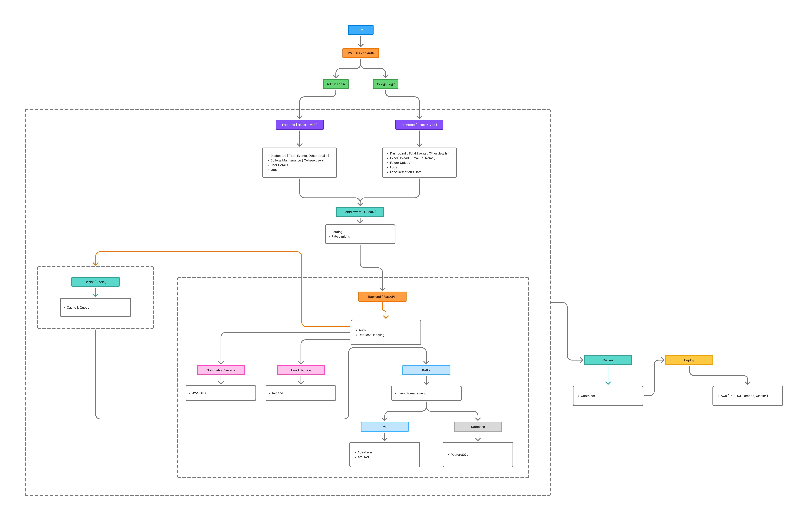

The diagrams below normalize the sketch around one login, role-based access, organization tenancy, asynchronous processing, and private delivery without removing any of the original workflow requirements.

## 1. Overall FDX workflow

FDX has one login system. There are not separate Admin Login and College Login systems. Authentication issues a JWT/session, resolves the user's role, and routes the user to the correct role-protected frontend area.

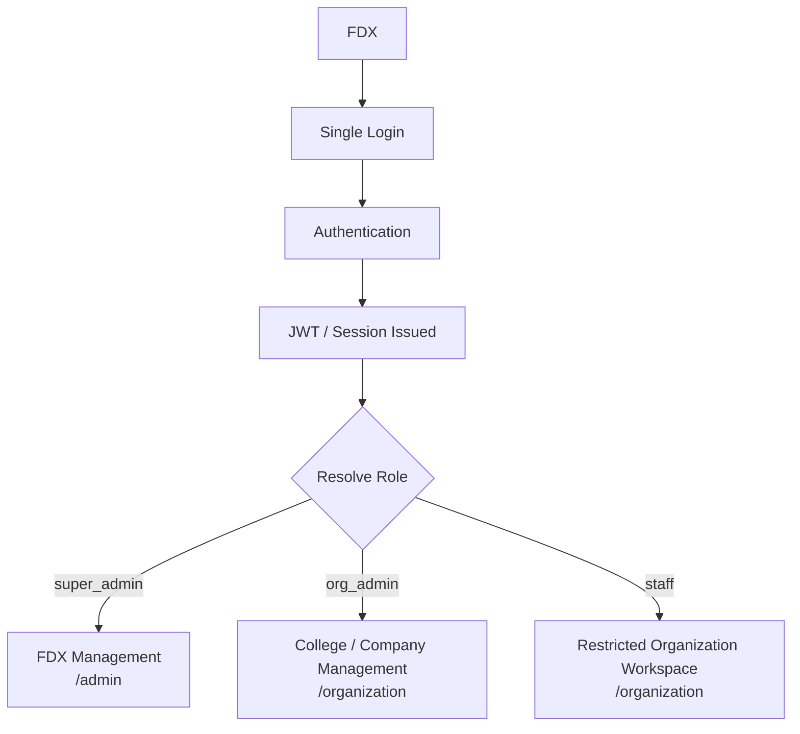

The frontend already follows this model through role-protected routes. The canonical routing rule is:

```text
One Login
├── role = super_admin → /admin
├── role = org_admin   → /organization
└── role = staff       → /organization (permission restricted)
```

## 2. Super Admin workflow

The Super Admin manages FDX itself rather than individual events.

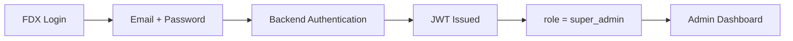

The Admin Dashboard should expose:

- Total organizations
- Total organization users
- Total events
- Total photos
- Total storage used
- Processing jobs
- Emails sent
- Failed jobs
- Expiring data
- System health

## 3. Organization management

The Super Admin creates and manages colleges or companies. Do not maintain separate `College` and `Company` tables. Use a single `Organization` entity with a type discriminator:

```text
Organization
├── type = COLLEGE
└── type = COMPANY
```

The organization record contains at least:

| Field | Purpose |
| --- | --- |
| `id` | Organization identifier |
| `name` | College or company name |
| `type` | `COLLEGE` or `COMPANY` |
| `email` | Primary contact email |
| `storage_limit` | Allocated storage quota |
| `storage_used` | Current accounted usage |
| `retention_days` | Default retention policy |
| `status` | Active, suspended, or expired state |
| `created_at` | Creation timestamp |
| `expires_at` | Optional account/subscription expiry |

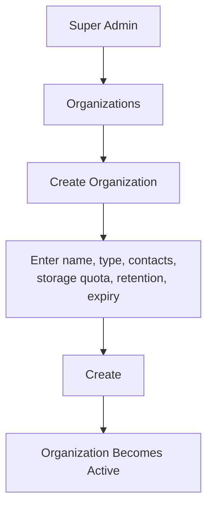

## 4. Organization user creation

After creating an organization, the Super Admin creates its administrator:

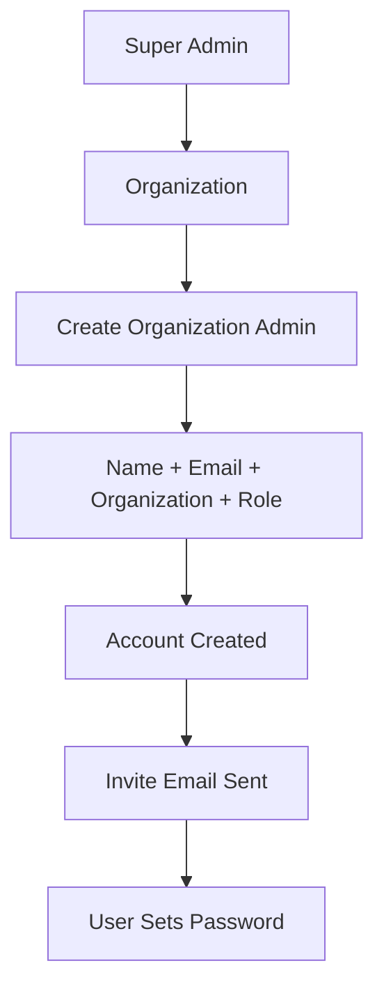

Example organization membership:

```text
CIT
├── user1@cit.edu → Org Admin
├── user2@cit.edu → Org Admin
└── user3@cit.edu → Staff
```

The minimum role model is `super_admin` and `org_admin`. Staff can be introduced as a restricted organization role; when enabled, it must be permission-scoped rather than equivalent to an Organization Admin.

## 5. Storage and expiry management

Storage quota, retention, and account expiry are primarily controlled by the FDX Super Admin.

Example organization summary:

| Metric | Example |
| --- | --- |
| Organization | College A |
| Storage | 120 GB / 200 GB |
| Retention | 90 days |
| Events | 28 |
| Next expiry | 24 Aug 2026 |

The Admin can configure:

- Storage limit: 100 GB, 500 GB, 1 TB, or another configured value.
- Retention policy: 30, 60, 90, 180, or custom days.
- Account expiry: optional subscription expiry.

A scheduled backend job enforces event-data expiry:

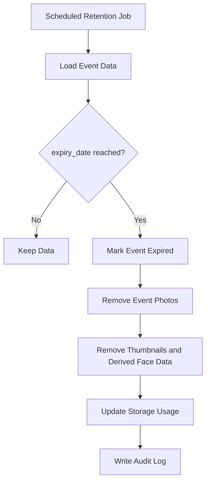

## 6. College / Company workflow and tenant isolation

When an Organization Admin logs in, the JWT determines both the role and the organization tenant:

```text
Login
→ JWT
→ role = org_admin
→ organization_id determined
→ Organization Dashboard
```

Tenant isolation is mandatory. If a logged-in user belongs to `organization_id = CIT`, every organization-scoped backend query must effectively include:

```sql
WHERE organization_id = 'CIT'
```

An organization user must never be able to access another organization's events, users, participants, photographs, matches, deliveries, or logs. Authorization must be enforced by the backend, not only hidden in the frontend.

## 7. Organization dashboard

The Organization Dashboard should be organized around:

- Dashboard
- Events
- Participants
- Uploads
- Processing
- Face Matches
- Deliveries
- Logs
- Settings

The frontend areas previously called College Dashboard, Upload Data, Students, Events, Face Detection Data, and Logs evolve into this organization-neutral structure rather than requiring a complete redesign. Use **Participants**, not **Students**, so FDX works for both colleges and companies.

## 8. Event creation workflow

Event creation begins the main FDX business workflow.

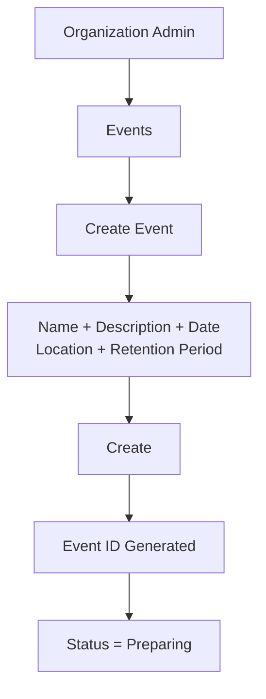

Example event:

| Field | Value |
| --- | --- |
| Event | GDG DevFest 2026 |
| Organization | Chennai Institute of Technology |
| Date | 12 August 2026 |
| Status | Preparing |

## 9. Participant upload

The organization imports the people who attended the event from CSV or Excel. An example `participants.csv` is:

```csv
Name,Email
Dijo,dijo@example.com
John,john@example.com
Alex,alex@example.com
```

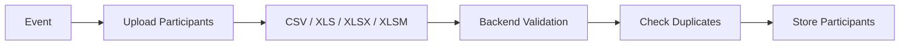

Each participant record contains approximately:

| Field | Purpose |
| --- | --- |
| `id` | Participant identifier |
| `event_id` | Parent event |
| `organization_id` | Tenant boundary |
| `name` | Participant name |
| `email` | Delivery and enrollment email |
| `enrollment_status` | Invitation/consent/enrollment state |
| `delivery_status` | Gallery delivery state |

## 10. Face enrollment email

After participants are imported, FDX creates an individual secure enrollment link and sends it by email.

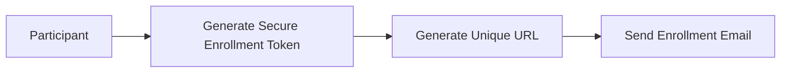

Example link:

```text
https://fdx.app/enroll/x82hd82ks9
```

Example email content:

> Photos from GDG DevFest are being processed. To find photographs containing you, please verify your face using the secure link below. **Find My Photos**

Development can use the persistent email outbox. Production delivery uses Resend or AWS SES credentials.

## 11. Attendee face capture workflow

The participant does not need an FDX account. The secure enrollment token authorizes only the intended enrollment flow.

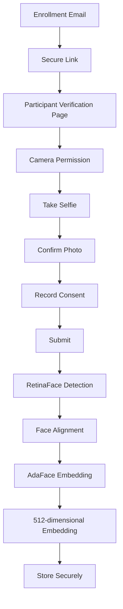

The current implementation uses RetinaFace R50 for detection and AdaFace IR101 for identity matching through ONNX Runtime. This workflow builds on that recognition pipeline rather than replacing it.

## 12. Event photo upload

The Organization Admin uploads the photographer's event folder as files, a browser-selected folder, a ZIP archive, or a batch upload.

Example folder:

```text
DevFest2026/
├── IMG_001.jpg
├── IMG_002.jpg
├── IMG_003.jpg
├── IMG_004.jpg
└── ...
```

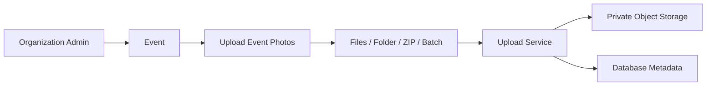

The database stores metadata such as `event_id`, `photo_id`, `storage_key`, `upload_time`, and `processing_status`. Image objects normally live in object storage:

```text
organizations/
└── org_001/
    └── events/
        └── event_023/
            ├── original/
            └── thumbnails/
```

Originals and thumbnails must be served securely rather than exposed as public objects.

## 13. Processing pipeline

When upload completes, FDX creates asynchronous processing jobs. Kafka is the primary job transport, with worker-side processing and durable application state.

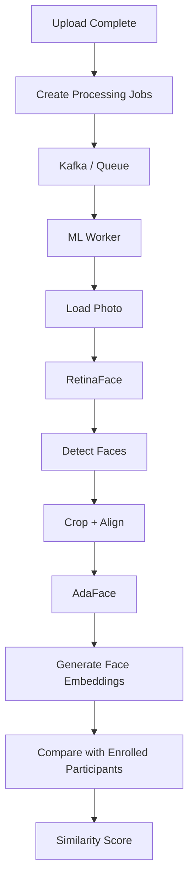

The repository's existing RetinaFace → AdaFace recognition path and cosine-similarity matching directly implement this architecture.

## 14. Face matching

Participant enrollment embeddings are compared with every detected face embedding in the same event.

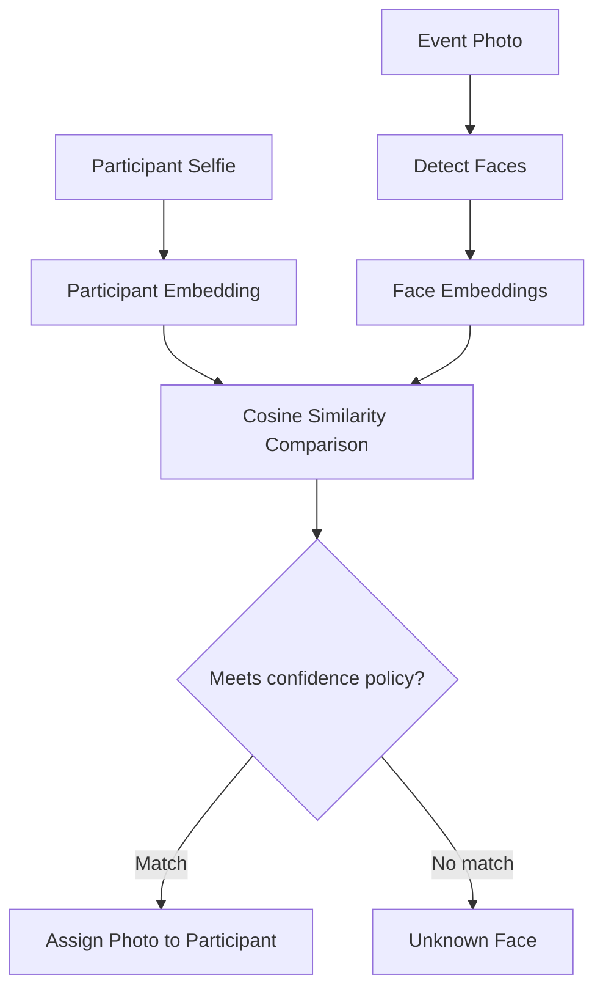

The output can associate many photos with one participant:

```text
Dijo
├── IMG_001.jpg
├── IMG_018.jpg
├── IMG_052.jpg
└── IMG_103.jpg

John
├── IMG_002.jpg
├── IMG_010.jpg
└── IMG_088.jpg
```

Multiple participants can naturally appear in the same photograph, so a photo can have multiple participant matches.

## 15. Confidence handling

Do not immediately accept every similarity result. Use three confidence states:

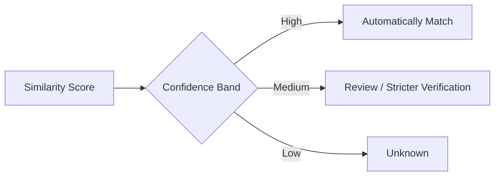

The matching configuration is deliberately conservative. Similarity thresholds must be calibrated with actual camera and event data.

## 16. Results dashboard

An event dashboard should summarize upload, enrollment, processing, matching, and delivery. Example metrics:

| Metric | Example value |
| --- | ---: |
| Photos uploaded | 3,482 |
| Faces detected | 8,920 |
| Participants | 672 |
| Faces submitted | 601 |
| Participants matched | 574 |
| Unmatched | 27 |
| Emails delivered | 548 |
| Processing | 26 |

The event advances through:

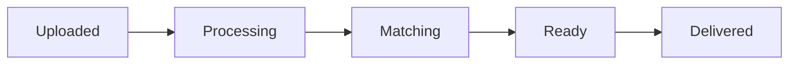

Event-level results may be represented across dashboard pages, but together they must expose the complete event state and the metrics above.

## 17. Showing photos to participants

After a participant submits a selfie, FDX shows approved matches directly on the enrollment page. The original enrollment link can be reopened for 24 hours; no separate result email is required.

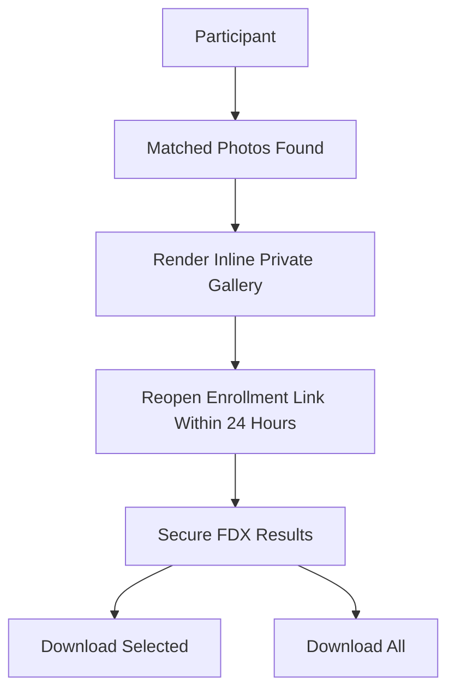

The participant sees a private grid of matched photographs on the same page, with per-photo download actions.

The enrollment link expires after 24 hours. Originals and thumbnails remain protected behind participant-scoped access checks.

## 18. Full participant workflow

This is the primary end-to-end product sequence. Participant enrollment and event-photo upload can happen independently; ML processing joins them before delivery.

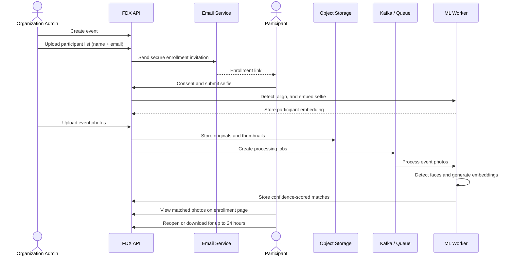

## 19. Recommended layered architecture

The system is easiest to understand as horizontal layers instead of placing Redis, email, Kafka, ML, Docker, and AWS at the same architectural level.

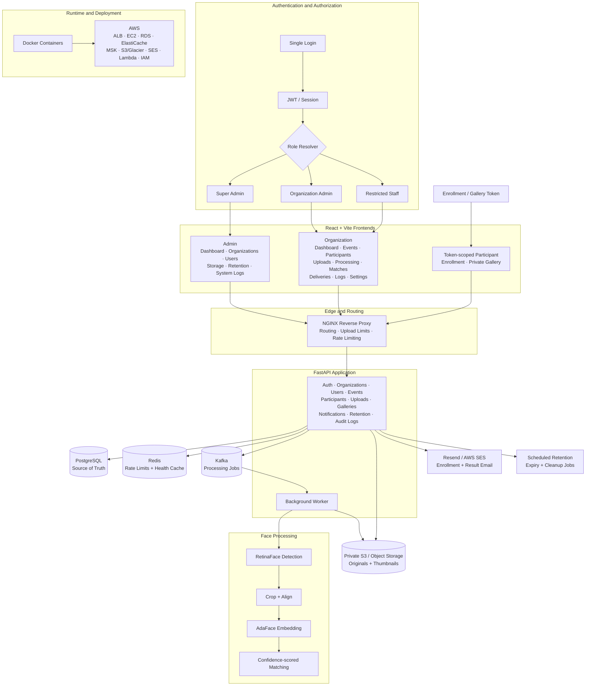

### Layer responsibilities

| Layer | Responsibility |
| --- | --- |
| Authentication | One login, JWT/session issuance, role and tenant resolution |
| Admin frontend | Global platform, organization, quota, retention, and health management |
| Organization frontend | Events, participants, uploads, processing, matches, deliveries, logs, and settings |
| NGINX | Routing, upload controls, reverse proxying, and rate limiting |
| FastAPI | Auth, tenancy, requests, metadata, orchestration, and secure media endpoints |
| PostgreSQL | Authoritative application state and durable job fallback |
| Redis | Login rate limiting and health caching |
| Kafka | Asynchronous event-photo processing jobs |
| Face processing | RetinaFace detection, alignment, AdaFace embeddings, and matching |
| External services | Private object storage, email delivery, retention, and cleanup |
| Deployment | Docker locally and the AWS production infrastructure stack |

## 20. Required terminology and diagram corrections

The old conceptual flow:

```text
FDX → JWT → Admin Login / College Login
```

must be represented as:

```text
FDX → Single Login → Authentication → JWT → Role Resolution
                                            ├── SUPER_ADMIN
                                            ├── ORG_ADMIN
                                            └── STAFF (restricted)
```

Apply these terminology rules everywhere:

- Replace **College Login** with **Organization Dashboard — College / Company**.
- Replace **Students** with **Participants**.
- Use **Organization** as the backend, API, JWT, storage, Kafka, and permission concept.
- The frontend may display **College** or **Company** according to `organization.type`.

## 21. Permission model

The clean permission model is:

| Function | Super Admin | Organization Admin | Staff |
| --- | :---: | :---: | :---: |
| Login | ✓ | ✓ | ✓ |
| Create organizations | ✓ | — | — |
| Delete/suspend organizations | ✓ | — | — |
| Set storage quotas | ✓ | — | — |
| Set retention policy | ✓ | — | — |
| Create organization admins | ✓ | — | — |
| View global system stats | ✓ | — | — |
| Create events | — | ✓ | Permission-scoped |
| Upload participants | — | ✓ | Permission-scoped |
| Upload event photos | — | ✓ | ✓ when granted |
| Process faces | — | ✓ | ✓ when granted |
| View matches | — | ✓ | Read-only when granted |
| Send participant emails | — | ✓ | — unless granted |
| View organization logs | Limited/global | ✓ | Read-only when granted |
| Delete event | Optional | ✓ | — |

Staff permissions are optional extensions to the minimum `super_admin`/`org_admin` model. Every permitted Staff action remains tenant-scoped.

## 22. Core database structure

FDX does not need dozens of entities to express its core domain. The principal relationship is:

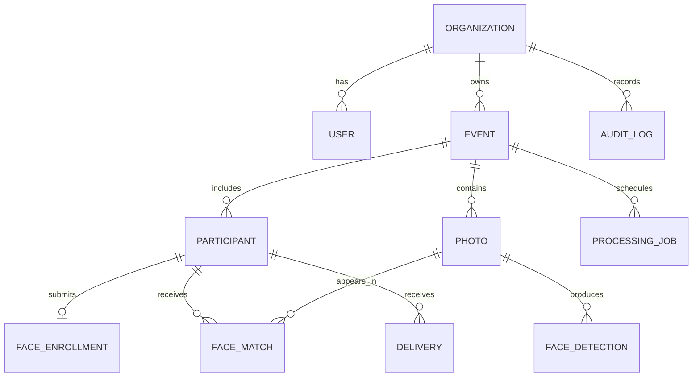

Core relational tables:

```text
organizations
users
events
participants
face_enrollments
photos
face_detections
face_matches
deliveries
audit_logs
processing_jobs
```

All tenant-owned records must retain an organization relationship directly or through a securely validated parent relationship.

## 23. FDX business workflow in one sentence

> An organization creates an event → uploads attendee identities and event photographs → FDX securely enrolls attendees' faces → processes the event gallery → identifies each attendee across the photographs → privately delivers each attendee only the photographs containing them.

The Super Admin sits one level above this workflow and manages organizations, users, storage, retention policies, account expiry, auditability, and platform health.

The architecture fits the existing codebase: React/Vite provides role-scoped Super Admin and Organization dashboards; FastAPI owns authentication and workflow orchestration; PostgreSQL, Redis, and Kafka provide persistence, caching/rate limiting, and job delivery; RetinaFace/AdaFace provides local face processing; private storage and email services provide delivery; Docker and AWS provide runtime and deployment.

The essential architectural rule is to remove **College** as a first-class backend concept and use **Organization** everywhere. College or Company is presentation determined by `organization.type`; APIs, database schemas, JWT claims, storage keys, Kafka messages, and permissions stay identical for both.
